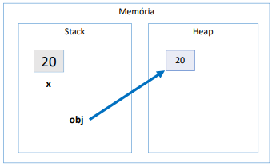
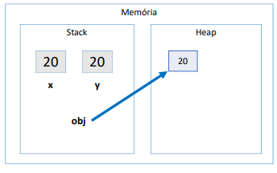

#Boxing, unboxing e wrapper classes

## Boxing

Boxing é o processo de conversão de um objeto do tipo valror para um objeto referência compatível.

~~~Java
int x = 20;

Objetct obj = x;
~~~

## Unboxing

É o processo de convesão de um objeto do tipo referência para um objeto do tipo valor compatível
~~~Java
int x = 20;

Objetct obj = x;

int y = (int) obj;
~~~

## Wrapper classes

* São classes equivalentes aos tipos primitivos.
* Boxing e unboxing é natural na linguagem.
* Uso comum: campos de entidades em sistemas de informação
1. Pois tipos referência (classes) aceitam valor null e usufruem dos recursos de OO (Exemplo: Um campo que não é obrigatório o preenchimento -- endereço ou data de nascimento em um formulário)