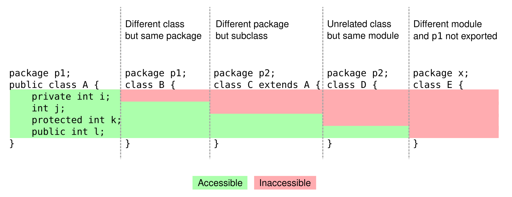

# Sobrecarga

Sobregarga (overloading) é um conceito relacionado à capacidade do Java de ter vários métodos ou construtores com o mesmo nome, mas com diferentes paramêtros

A sobrecarga permite que você defian vários métodos em uma classe com o mesmo nome, desde que eles tenham parâmetros diferentes ou um números diferente de paramêtros.

~~~Java
public class Product {
    public String name;
    public double price;
    public int quantity;
    
    public Product() {
    }

    public Product(String name, double price, int quantity) {
        this.name = name;
        this.price = price;
        this.quantity = quantity;
    }
    public Product(String name, double price) {
        this.name = name;
        this.price = price;
    }
~~~

# Encapsulamento

Consiste em esconder detalhes de implemantação de uma classe, expondo apenas operações seguras e que mantenham os objetos em um estado consistente.

* Um objeto não deve expor nenhum atributo(modificador de acesso private)
* Os atributos devem ser acessador por meio de métodos get e ser.

~~~Java
private String name;
private double price;
public String getName() {
return name;
}

public void setName(String name) {
    this.name = name;
}

public double getPrice() {
    return price;
}

public void setPrice(double price) {
    this.price = price;
}
~~~

# Modificadores de acesso

* <b>Private:</b> o membro só pode ser chamado na própria <b>classe</b>.
* (nada, somente a variavel declarada) o membro só pode ser acessador nas classes do <b>mesmmo pacote</b>
* <b>protected</b>: o membro só pode ser acessador nas classes do <b>mesmo pacote</b>
* <b>public</b>: o membro é acessado por todas as classes (menos as que ele resida em um módulo diferente que não exporte o pacote onde ele está)

<https://docs.oracle.com/javase/tutorial/java/javaOO/accesscontrol.html>