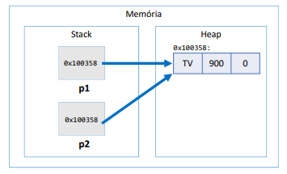
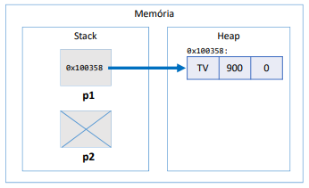
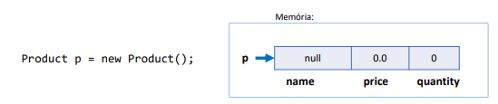

# Tipos referência vs  tipos valor

## Classes são tipos referência

Variáveis cujo tipo são classes não devem ser entendidas como caixas, mas sim como "ponteiros" para caixas.
~~~ Java
Product p1, p2;
p1 = new Product("TV". 900.00);

p2 = p1;
~~~

No exemplo acima `p2 = p1;` 

p2 passa a apontar para onde p1 aponta.

### Valor null

Tipos referência aceitam o valor 'null', que indica que a variável aponta para ninguém.

~~~ Java
Product p1, p2;
p1 = new Product("TV". 900.00);

p2 = null;
~~~

## Tipos primitivos são tipos valor

Em Java, tipos primitivos são tipos valor. Tipos valor são CAIXAS e não ponteiros.

~~~ Java
double x, y;
x = 10;

y = x;
~~~

No exemplo acima `y = x;` 

y recebe uma CÓPIA de x.

### Valores padrão

Quando alocamos (new) qualquer tipo estruturado (classe ou array), são atribuídos valores padrão aos seus elementos.
* números: 0
* boolean = false
* char: caractere código 0
* objeto: null

### Tipos referência vs tipo valor

| <b>Classe | Tipo primitivo</b> |
|---|--------|
|Vantagem: usufrui de todos recursos OO:   |   Vantagem: é mais simples e mais performático     |
|Variáveis são ponteiros   |    Variáveis são caixas    |
| Objetos precisam ser instanciados usando new, ou
apontar para um objeto já existente.  |    Não instancia. Uma vez declarados, estão prontos
para uso    |
| Aceita valor null  |   Não aceita valor null     |
|Y = X; "Y passa a apontar para onde X aponta"   |   Y = X; "Y recebe uma cópia de X"     |
| Objetos instanciados no heap  |    "Objetos" instanciados no stack    |
| Objetos não utilizados são desalocados em um momento próximo pelo garbage collector  |   "Objetos" são desalocados imediatamente quando seu escopo de execução é finalizado     |
