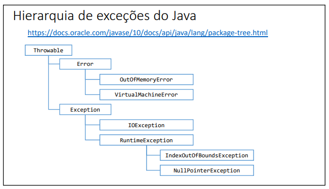

# Exceções

1. Uma exceção é qualquer condição de erro ou comportamento
inesperado encontrado por um programa em execução

2. Em Java, uma exceção é um objeto herdado da classe:
* java.lang.Exception - o compilador obriga a tratar ou propagar
* java.lang.RuntimeException - o compilador não obriga a tratar ou propagar

3. Quando lançada, uma exceção é propagada na pilha de chamadas de
métodos em execução, até que seja capturada (tratada) ou o
programa seja encerrado

### Porque exceções?

1. O modelo detratamaneto de exceções permite que erros sejam tratados de forma consistente e flexível

2. Vantagens:

* Delega a lógica do erro para  a classe rensposável por conhecer as regras que podem ocasionar o erro.

* Trata de forma organizada (inclusive hierárquica) exceções de tipos diferentes 

* A exceção pode carregar dados quaisquer

## Estrutura try-catch

1. Bloco try
* Contém o código que representa a execução normal do trecho de código que
pode acarretar em uma exceção

2. Bloco catch
* Contém o código a ser executado caso uma exceção ocorra
* Deve ser especificado o tipo da exceção a ser tratada (upcasting é permitido)

## Bloco finally

1. É um bloco que contém código a ser executado independentemente de ter
ocorrido ou não uma exceção.
2. Exemplo clássico: fechar um arquivo, conexão de banco de dados, ou outro
recurso específico ao final do processamento.
~~~Java
try {
}
catch (ExceptionType e) {
}
finally {
}
~~~
