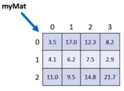

# Matrizes

1. Matriz é noma dado a arranjos bidimensionais. (Vetor de vetores)

2. Arranjo (array) é uma estrutara de dados:

* Homogênea (dados do mesmo tipo)
* Ordenada (elementos acessados por meio de posições)
* Alocada de uma vez só

3. Vantagens

* Acesso imediato aos elementos pela sua posição

4. Desvantagens 

* Tamanho fixo
* Dificuldade para se realizar inserções e deleções

