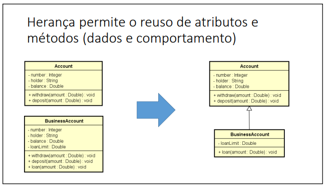
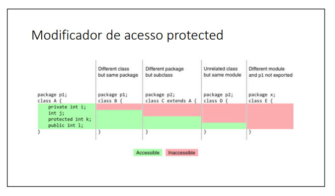

# Herança

* É um tipo de associação que permite que uma classe herde todos os dados e comportamentos de outras

* Vantagens:
1. Reuso
2. Polimorfismo

* Sintaxe
1. class A extends B

## Super

Em Java, super() é uma chamada ao construtor da classe pai (superclasse) a partir de uma classe filha (subclasse). Isso é utilizado para chamar o construtor da classe pai e executar as operações de inicialização que estão definidas nessa classe pai. A chamada super() deve ser a primeira instrução no construtor da classe filha.

Quando uma classe filha estende outra classe (é uma subclasse), ela herda os membros (campos e métodos) da classe pai. O construtor da classe pai é chamado implicitamente sempre que um objeto da classe filha é criado. No entanto, se a classe pai tiver um construtor que aceita parâmetros, e você quiser inicializar esses parâmetros ao criar um objeto da classe filha, é necessário chamar explicitamente super() no construtor da classe filha.

### Exemplo
~~~Java
public class Pai {
    private int valor;

    public Pai(int valor) {
        this.valor = valor;
    }
}

public class Filho extends Pai {
    private String nome;

    public Filho(int valor, String nome) {
        super(valor); // Chama o construtor da classe Pai
        this.nome = nome;
    }
}
~~~

No exemplo acima, a classe Filho estende a classe Pai. O construtor da classe Filho chama super(valor) para garantir que o construtor da classe Pai seja executado antes de qualquer código adicional no construtor da classe Filho. Isso assegura que o campo valor da classe Pai seja inicializado corretamente quando um objeto da classe Filho é criado.

## Protected 

Em Java, protected é um modificador de acesso que pode ser aplicado a membros da uma classe. Quando um membro de uma classe é declarado como protected, ele fica acessível para classes dentro do mesmo pacote e para subclasses (mesmo que estejam em pacotes diferentes).

### Exemplo

~~~Java
    package pacoteA;

public class ClasseA {
    protected double balance;

    // Restante da classe...
}
~~~
~~~Java
package pacoteB;

import pacoteA.ClasseA;

public class ClasseB extends ClasseA {
    public void exemplo() {
        // A classe ClasseB (em pacoteB) pode acessar o campo protected balance
        this.balance = 1000.0;
    }
}
~~~

No exemplo acima, ClasseB herda de ClasseA, e como balance é protegido (protected) em ClasseA, ClasseB pode acessá-lo diretamente.

O modificador protected é muitas vezes utilizado quando se deseja fornecer acesso a membros para subclasses, mas ainda deseja manter um certo nível de encapsulamento, restringindo o acesso a classes fora do pacote.

### Definições importantes

* Relação 'é um' (significa que a classe 'A' é um tipo da classe 'B', ou seja a classe A herda características da classe B.)

* Generalização/especialização (toda conta é uma conta ou seja 'Account' é uma generalização e 'BusinessAccount' é uma especializção)

* Superclasse (classe base) / subclasse (classe derivada)

* Herança / extensão

* Herença é uma associação entre classe (e não entre objetos)

# Upcasting e downcasting

* Upcasting
1. Casting da subclasse para superclasse
2. Uso comum: polimorfismo

• Downcasting
1. Casting da superclasse para subclasse
2. Palavra instanceof
3. Uso comum: métodos que recebem parâmetros genéricos (ex: Equals)

### Exemplo

~~~Java
public class Program {
    public static void main(String[] args) {

        Account acc = new Account(1001, "Luis", 0.0);
        BusinessAccount bacc = new BusinessAccount(1002, "Maria", 0.0, 500.0);

        // UPCASTING

        Account acc1 = bacc;
        Account acc2 = new BusinessAccount(1003, "Lucas", 0.0, 200.0);
        Account acc3 = new SavingsAccount(1004, "César", 0.0, 0.01);

        // DOWNCASTING

        BusinessAccount acc4 = (BusinessAccount)acc2; //casting manual para forçar a conversão
        acc4.loan(100);

        /*BusinessAccount acc5 = (BusinessAccount)acc3; essa linha da erro pois o compilador não sabe que acc3 é uma savingAccount
        dessa forma somente quando o programa é executado que recebemos o erro. */
        // Para que a conversão de certo testamos com instanceof

        if (acc3 instanceof BusinessAccount){ // Verifica se a conta é uma instãncia de BusinessAccount
            BusinessAccount acc5 = (BusinessAccount)acc3; // Se sim, realiza a conversão BusinessAccount
            acc5.loan(200.0);
            System.out.println("Loan!");
        }
        if (acc3 instanceof SavingsAccount){ // Verifica se a conta é uma instãncia de SavingsAccount
            SavingsAccount acc5 = (SavingsAccount)acc3; // Se sim, realiza a conversão SavingsAccount
            acc5.updateBalance();
            System.out.println("Update");
        }

    }
}
~~~

# Sobreposição ou sobrescrita

* É a implementação de um método de uma superclasse na subclasse

* É fortemente recomendável usar a anotação @OVerride em um método sobrecrito
1. Facilita a leitura e comprensão do cógido
2. Avisamos ao compilador (boa prática)

### Exemplo

Suponha que a operação de saque possui uma taxa no valor de 5.0. Entretanto, se a conta for do tipo poupança, esta taxa não deve ser cobrada.

Sobrescrevendo o método withdraw na subclasse SavingsAccount conseguimos resolver isso

~~~Java
// Account:
public void withdraw(double amount) {
    balance -= amount + 5.0;
}

//SavingsAccount:
@Override
public void withdraw(double amount) {
    balance -= amount;
}

~~~

## Palavra super

É possível chamar a implementação da superclasse usando a palavra super.

Exemplo: suponha que, na classe BusinessAccount, a regra para saque seja realizar o saque normalmente da superclasse, e descontar mais 2.0.

~~~Java
@Override
public void withdraw(double amount) {
    super.withdraw(amount);
    balance -= 2.0;
}
~~~

