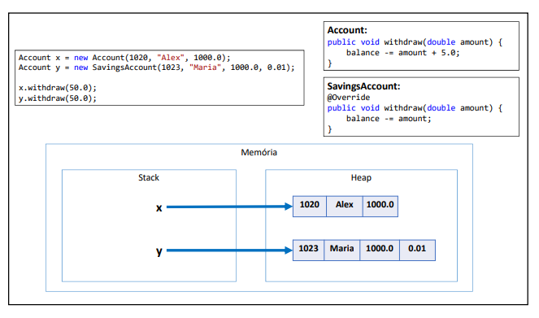

# Classes e métodos final

- Palavra chave: final

- Classe: evita que a classe seja herdada

~~~Java
    public final class SavingsAccount {
~~~
- Método: evita que  o método seja sobreposto

## Para quê?

- Segurança: dependendo das regras do négócio, às vezes é desejavel garantir que uma classe não seja herdada, ou que um método não seja sobreposto.
1. Geralmente convém acrescentar final em métodos sobrepostos, pois sobreposições múltiplas podem ser uma porta de entrada para inconsistências.

- Performance: atributos de tupo de uma classe final são analisados de forma mais rápida em tempo de execução;
1. Exemplo clássico: String - Documentação:
[https://docs.oracle.com/javase/8/docs/api/java/lang/String.html]

# Polimorfismo

## Pilares da OOP

- Encapsulamento
- Herança
- Polimorfismo

### Polimorfismo 

Em POO, polimorfismo é o recurso que permite que variáveis de um mesmo tipo genérico possam apontar para objetos de tipos específicos diferentes, tendo assim comportanmentos diferentes conforme cada tipo específico.

~~~Java
Account x = new Account(1020, "Alex", 1000.0);
Account y = new SavingsAccount(1023, "Maria", 1000.0, 0.01);

x.withdraw(50.0);
y.withdraw(50.0);
~~~

- A associação do tipo específico com o tipo genérico é feita em tempo de execução(upcasting).

- O compilador não sabe para qual tipo específico a chamada do método Withdraw está sendo feita (ele só sabe que são duas variáveis do tipo Account):
