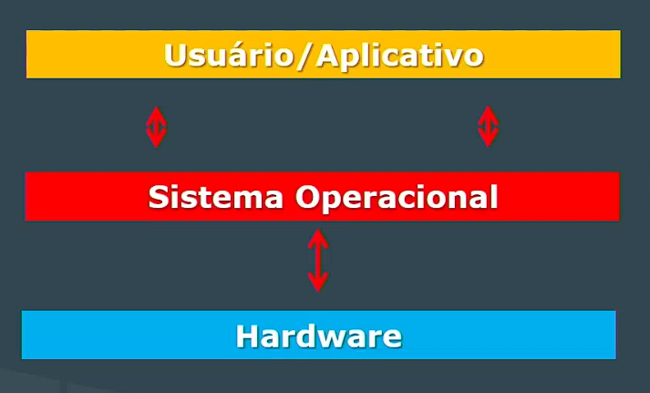
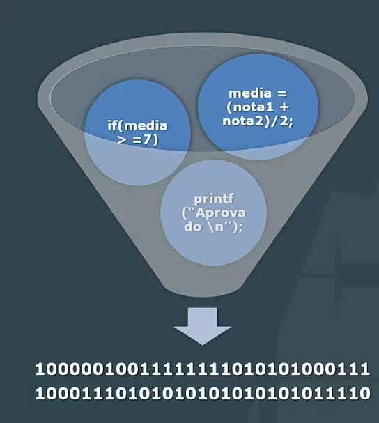
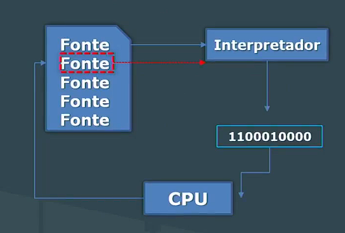
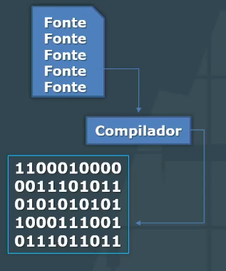

# Fundamentos de Desenvolvimento de Software

## Software, programas e sistemas

### Software consiste em:

1. **Instruções** (programas de computador) que, quando executadas, fornecem características, funções e desempenho desejados.

2. **Estruturas de dados** possibilitam aos programas manipular informações adequadamente.

3. **Informação descritiva**, tanto na forma virtual quanto na impressa, descrevendo a operação e o uso dos programas.

Simplificando, software é um programa de computador e toda a documentação associada a ele. É uma categoria mais ampla que engloba todos os programas utilizados em um sistema de computador.

Enquanto programa é um conjunto específico de código usado para realizar uma tarefa específica dentro desse software.

## Software de sistema (Básico)

- Coleção de programas para apoiar outros programas.
- Sistema operacional.
- Softwares utilitários ou ferramentas de sistema.

## Software utilitário

- Fornecem ao usuário ferramentas para organizar os discos, verificar disponibilidade de memória, corrigir falhas de processamento.
- Úteis ao sistema computacional.
- Exemplos: antivírus, compactadores, emuladores, desfragmentadores, formatadores, backup.

## Software aplicativo

- Programas que auxiliam o usuário a realizar determinada tarefa.
- Popularmente conhecidos como apps.
- Exemplos: navegadores, aplicativos de celular em geral, editores de texto, editores de imagens.

# Sistema operacional

- Software responsável pela supervisão dos processos executados em um computador
- Gerencia todo o hardware e todo o software do computador e realiza a "comunicação" entre eles
  

## Funcões do SO

- Facilitar o uso do computador pelo usuário
- Gerenciar recursos do computador
- COntrolar a execução de programas pela CPU

# Sistema tradutores

- **Programa escrito em linguagem de alto nível:** Precisa ser traduzido para que o computador possa executá-lo.

  

- **Interpretadores e compiladores:**

  - **Interpretador:** Um interpretador é um programa que executa o código-fonte de um programa linha por linha, traduzindo e executando as instruções conforme são encontradas. Ele traduz o código-fonte em linguagem de máquina e executa imediatamente cada instrução.

  

  - **Compilador:** Um compilador é um programa que traduz todo o código-fonte de um programa de uma só vez, produzindo um arquivo executável que pode ser executado pelo computador posteriormente. Ele traduz todo o código-fonte para linguagem de máquina antes da execução.

  

Ambos, interpretadores e compiladores, são utilizados para converter código-fonte de alto nível em linguagem de máquina compreensível pelo computador, permitindo assim a execução dos programas.

# Algoritmos

- "Algoritmo é uma sequência de passos que visa atingir um objetivo bem definido" (Forbellone, 1999)
- Objetivo: representar mais fielmente o raciocínio envolvido na lógica de programação
- Uma vez concebida uma solução, esta pode ser traduzida para qualquer linguagem de programação

## Sintaxe x semântica

- Gap semântico entre lógica de programação e a lógica do dia a dia
- Semântica na linguagem de programação: referindo ao conteúdo, ao significado
- Sintaxe está relacionada com as regras, premissas, restrições
- Modo como as palavras podem ser combinadas e formar os enunciados define a sintaxe

Em programação, tanto a sintaxe quanto a semântica são aspectos fundamentais da linguagem de programação, mas referem-se a coisas distintas:

1. **Sintaxe:**
   - A sintaxe se refere à estrutura e às regras gramaticais da linguagem de programação. 
   - Envolve a forma como as instruções são escritas e organizadas dentro do código-fonte.
   - Inclui elementos como palavras-chave, operadores, pontuação e estruturas de controle de fluxo (como loops e condicionais).
   - Erros de sintaxe geralmente ocorrem quando o código não segue as regras gramaticais da linguagem, como esquecer um ponto e vírgula no final de uma linha ou usar uma palavra-chave de forma incorreta.

2. **Semântica:**
   - A semântica se refere ao significado das instruções e expressões dentro do código.
   - Envolve como as instruções são interpretadas e executadas pelo computador.
   - Inclui aspectos como o comportamento esperado do programa e a lógica por trás das operações realizadas.
   - Erros de semântica geralmente ocorrem quando o código não produz os resultados esperados devido a uma compreensão incorreta das instruções ou uma lógica incorreta na implementação.

Em resumo, a sintaxe trata da forma como o código é escrito e organizado, enquanto a semântica trata do significado e do comportamento do código durante a execução. Ambos são cruciais para escrever programas funcionais e corretos.