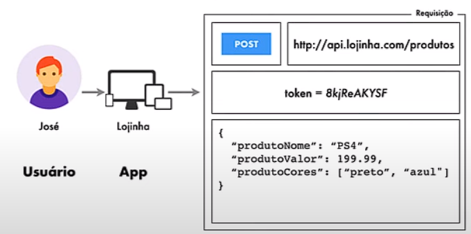

# Conceitos básicos de API's Rest

O app faz uma requisição direta a API enviando a ela o que chamamos de requisição. Geralmente, requisições são enviadas a paritdo do protocolo HTTPS ou HTTP. Vemos abaiaxo a estrutura de uma requisição:

**Token**: Em muitas APIs REST, a autenticação é necessária para acessar recursos protegidos. Tokens de acesso, como tokens JWT (JSON Web Tokens), são comumente usados para autenticar e autorizar solicitações. Um token é geralmente enviado no cabeçalho de autorização da requisição HTTP, fornecendo ao servidor as credenciais necessárias para verificar a identidade do usuário e conceder acesso aos recursos protegidos.

URI significa "Uniform Resource Identifier" (Identificador Uniforme de Recurso). É uma sequência de caracteres que identifica de forma única um recurso na web. 

Uma URI pode ser usada para identificar qualquer tipo de recurso, como um documento HTML, uma imagem, um arquivo de áudio, um serviço web, entre outros. Geralmente, uma URI é composta por dois componentes principais:

1. **URL (Uniform Resource Locator)**: É uma forma mais específica de URI que fornece não apenas a identificação do recurso, mas também a localização do recurso na rede. Por exemplo: `https://www.exemplo.com/recurso`.

2. **URN (Uniform Resource Name)**: É uma forma mais genérica de URI que fornece apenas a identificação do recurso, sem incluir informações sobre sua localização na rede. Por exemplo: `urn:exemplo:recurso`.

Em termos simples, uma URI é um identificador único que aponta para um recurso na web. Ela é usada em solicitações HTTP para acessar e manipular recursos em servidores web. Por exemplo, quando você acessa um site digitando sua URL no navegador, você está utilizando uma URI para identificar e acessar esse recurso na web.

### CRUD
Um CRUD (Create, Read, Update, Delete) é um conjunto de operações básicas usadas em sistemas de banco de dados ou na persistência de dados em geral. Aqui está uma descrição de cada método CRUD e algumas informações adicionais sobre tokens em APIs REST:

- **Create (Criar)**: O método POST é comumente usado para criar um novo recurso no servidor. Ao fazer uma requisição POST para um determinado endpoint (URI), os dados necessários para criar o recurso são enviados no corpo da requisição. O servidor então processa esses dados e cria o recurso conforme especificado.

- **Read (Ler)**: O método GET é utilizado para recuperar dados do servidor. Quando uma requisição GET é feita para um determinado URI, o servidor retorna os dados correspondentes a esse URI, permitindo que o cliente os leia. Este método é utilizado para buscar informações específicas ou listar recursos existentes.

- **Update (Atualizar)**: O método PUT ou PATCH é usado para atualizar um recurso existente no servidor. Com uma requisição PUT ou PATCH para um URI específico, o cliente envia os dados atualizados para o servidor. O servidor então atualiza o recurso correspondente conforme especificado nos dados enviados.

- **Delete (Excluir)**: O método DELETE é usado para remover um recurso do servidor. Quando uma requisição DELETE é feita para um URI específico, o servidor remove o recurso correspondente e retorna uma resposta indicando o sucesso ou falha da operação.

Portanto, ao utilizar uma API REST para realizar operações CRUD, você normalmente usaria diferentes métodos HTTP (POST, GET, PUT/PATCH, DELETE) para criar, ler, atualizar e excluir recursos, respectivamente. Além disso, para acessar recursos protegidos, você pode precisar incluir um token de acesso válido nas requisições.