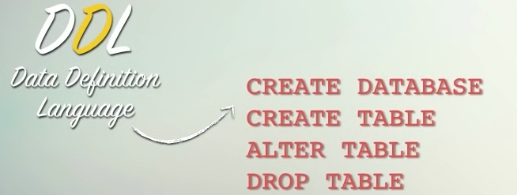

# Banco de dados

## Curso em vídeo - aula 1

**Resumo sobre Bancos de Dados com Foco em Banco de Dados SQL:**

**Surgimento:**
Bancos de dados têm suas raízes nas décadas de 1960 e 1970, quando a necessidade de armazenar e gerenciar grandes volumes de dados levou ao desenvolvimento dos primeiros sistemas de gerenciamento de banco de dados (SGBD). O SQL (Structured Query Language) foi padronizado pela primeira vez em 1986 e desempenhou um papel fundamental na popularização de bancos de dados relacionais.

Banco de dados contem tabelas, tabelas contem registro, registros são compostos por campos.

**Banco de Dados SQL:**
O SQL, ou Structured Query Language, é uma linguagem padrão para gerenciamento e manipulação de bancos de dados relacionais. Bancos de dados relacionais, como MySQL, PostgreSQL, Oracle, SQL Server, entre outros, utilizam o SQL para definir a estrutura dos dados, realizar consultas e manipulações.

**Principais Características:**

1. **Estrutura Relacional:**
   - **Tabelas:** Os dados são organizados em tabelas, que consistem em linhas e colunas. Cada tabela representa uma entidade.

2. **SQL como Linguagem de Consulta:**
   - **Consultas:** O SQL permite realizar consultas complexas para recuperar, inserir, atualizar ou excluir dados de maneira eficiente.

3. **Integridade de Dados:**
   - **Restrições:** São aplicadas restrições para garantir a integridade dos dados, como chaves primárias, estrangeiras e restrições de unicidade.

4. **Transações:**
   - **Atomicidade, Consistência, Isolamento e Durabilidade (ACID):** Os bancos de dados SQL seguem os princípios ACID para garantir a confiabilidade das transações.

5. **Normalização:**
   - **Normalização de Dados:** Processo que organiza os dados para reduzir redundâncias e melhorar a eficiência do banco de dados.

6. **Segurança:**
   - **Controle de Acesso:** SQL oferece recursos robustos para gerenciar permissões e garantir que apenas usuários autorizados acessem determinados dados.

7. **Desenvolvimento de Aplicações:**
   
   - **APIs e Drivers:** Plataformas SQL oferecem APIs e drivers que permitem a integração eficiente de bancos de dados com diferentes linguagens de programação.

8. **Escalabilidade e Desempenho:**
   - **Otimização de Consultas:** SGBDs SQL possuem otimizadores de consultas para melhorar o desempenho, especialmente em ambientes com grandes conjuntos de dados.

9. **Recuperação de Falhas:**
   - **Backup e Recuperação:** Mecanismos de backup e recuperação são essenciais para proteger os dados contra perdas inesperadas.

10. **Padrões ANSI-SQL:**
    - **Padronização:** O SQL é mantido pelo ANSI (American National Standards Institute) e pela ISO (International Organization for Standardization), garantindo consistência nas implementações.

## Aula 3

**Tipos primitivos em banco de dados**

Bancos de dados são compostos de tabelas, que por sua vez são compostas de registros. Os registros são compostos de campos, que podem ser de diferentes tipos.

Os tipos primitivos são os tipos de dados mais básicos que podem ser armazenados em um banco de dados. Eles são divididos em três categorias:

* **Números**
    * **Inteiros:** armazenam números inteiros, positivos ou negativos.
        * **TynyInt:** 1 byte
        * **SmallInt:** 2 bytes
        * **Int:** 4 bytes
        * **MediumInt:** 8 bytes
        * **BigInt:** 8 ou 16 bytes
    * **Reais:** armazenam números reais, com ou sem sinal.
        * **Decimal:** armazena números reais com precisão e escala definidas.
        * **Float:** armazena números reais com precisão simples.
        * **Double:** armazena números reais com precisão dupla.
        * **Real:** armazena números reais com precisão variável.
    * **Lógicos:** armazenam valores lógicos, verdadeiro ou falso.
        * **Bit:** armazena um bit, que pode ser 0 ou 1.
        * **Boolean:** armazena um valor lógico, TRUE ou FALSE.
* **Data/Tempo:** armazenam datas e/ou horas.
    * **Date:** armazena apenas a data.
    * **DateTime:** armazena a data e a hora.
    * **TimeStamp:** armazena a data, a hora e a microssegundos.
    * **Time:** armazena apenas a hora.
    * **Year:** armazena apenas o ano.
* **Literal:** armazena valores literais, como caracteres, strings e binários.
    * **Caracter:** armazena um caractere.
        * **Char:** armazena uma string de caractéres de tamanho fixo. 
        * **VarChar:** armazena uma string de caracteres de comprimento variável.
    * **Texto:** armazana caracteres e strings
        * **Text:** armazena uma string de caracteres de comprimento variável.
        * **TinyText:** armazena uma string de caracteres de comprimento limitado.
        * **MediumText:** armazena uma string de caracteres de comprimento médio.
        * **LongText:** armazena uma string de caracteres de comprimento longo.
    * **Binário:** armazena dados binários.
        * **TinyBlob:** armazena dados binários de comprimento limitado.
        * **Blob:** armazena dados binários de comprimento médio.
        * **MediumBlob:** armazena dados binários de comprimento médio.
        * **LongBlob:** armazena dados binários de comprimento longo.
    * **Coleção:** armazena uma coleção de valores.
        * **Enum:** armazena uma lista de valores possíveis.
        * **Set:** armazena uma coleção de valores exclusivos.
* **Espacial:** armazena dados espaciais, como coordenadas geográficas.
    * **Geometry:** armazena dados espaciais genéricos.
    * **Point:** armazena um ponto geográfico.
    * **Polygon:** armazena um polígono geográfico.
    * **MultiPolygon:** armazena uma coleção de polígonos geográficos.

Exemplos de uso:

* **Para armazenar o número de um produto, use o tipo `Int`.**
* **Para armazenar a data de nascimento de uma pessoa, use o tipo `Date`.**
* **Para armazenar o nome de uma pessoa, use o tipo `VarChar`.**
* **Para armazenar um arquivo de imagem, use o tipo `Blob`.**

## Aula 4

Uma **chave primária** (*primary key*, em inglês) é um conceito fundamental em bancos de dados relacionais. Ela é um campo ou um conjunto de campos em uma tabela de banco de dados que serve para identificar exclusivamente cada registro na tabela. Em outras palavras, não pode haver valores duplicados na coluna ou conjunto de colunas definidas como chave primária.

A chave primária desempenha um papel crucial na organização e integridade dos dados em um banco de dados. Algumas características importantes da chave primária são:

1. **Unicidade:** Cada valor na chave primária deve ser único para identificar distintamente cada linha na tabela.

2. **Não Nulidade:** Geralmente, a chave primária não permite valores nulos, garantindo que cada registro tenha uma identificação única.

3. **Índice:** A chave primária geralmente tem um índice associado a ela, o que melhora a eficiência das consultas de busca.

4. **Referencial:** A chave primária de uma tabela pode ser usada como chave estrangeira em outras tabelas para estabelecer relacionamentos entre elas.

Ao projetar um banco de dados, é comum escolher um campo ou conjunto de campos que seja intrinsecamente único para ser a chave primária. Exemplos comuns incluem IDs numéricos sequenciais, códigos alfanuméricos exclusivos, ou combinações de campos que, quando combinados, formam uma chave única.

## Aula 6

~~~SQL
-- Criação da tabela 'cursos' se ela não existir
CREATE TABLE IF NOT EXISTS cursos (
  nome VARCHAR(30) NOT NULL UNIQUE,
  descricao TEXT,
  carga INT UNSIGNED,
  totaulas INT UNSIGNED,
  ano YEAR DEFAULT '2024'
) DEFAULT CHARSET=utf8;

-- Descreve a estrutura da tabela 'cursos'
DESCRIBE cursos;

-- Adiciona a coluna 'idcurso' como a primeira coluna na tabela

ALTER TABLE cursos
ADD COLUMN idcurso INT FIRST;

-- Define a coluna 'idcurso' como chave primária
ALTER TABLE cursos
ADD PRIMARY KEY (idcurso);

-- Remove a coluna 'nome' da tabela 'cursos'
ALTER TABLE cursos
DROP COLUMN nome;

-- Adiciona a coluna 'name' como VARCHAR(30) NOT NULL UNIQUE após 'idcurso'
ALTER TABLE cursos
ADD COLUMN name VARCHAR(30) NOT NULL UNIQUE AFTER idcurso;

~~~
~~~Sql
-- Criação da tabela 'teste' se ela não existir
CREATE TABLE IF NOT EXISTS teste (
  id INT,
  nome VARCHAR(10),
  idade INT
);

-- Inserção de dados na tabela 'teste'
INSERT INTO teste VALUES
  (1, 'Pedro', 22),
  (2, 'Maria', 13),
  (3, 'Juliano', 31);

-- Descreve a estrutura da tabela 'teste'
DESCRIBE teste;

-- Seleciona todos os dados da tabela 'teste'
SELECT * FROM teste;
~~~

Adicionar uma chave primária (por exemplo, id INT PRIMARY KEY) é uma prática recomendada. A chave primária é uma coluna única que identifica exclusivamente cada registro na tabela. Usar uma chave primária oferece benefícios como:

* Identificação única: Garante que cada linha na tabela tenha uma identificação única.
* Eficiência nas consultas: Ajuda a acelerar as consultas devido à indexação eficiente.
* Integridade referencial: Facilita a criação de relações entre tabelas, mantendo a integridade referencial do banco de dados.

## Aula 7

### DDL (Data Definition Language):

DDL ou Linguagem de Definição de Dados, é usada para definir e gerenciar a estrutura do banco de dados. Comandos DDL afetam a estrutura do banco de dados, criando, alterando ou excluindo objetos como tabelas, índices, e esquemas. Alguns exemplos de comandos DDL incluem:

### DML (Data Manipulation Language):

DML, ou Linguagem de Manipulação de Dados, é usada para manipular os dados armazenados no banco de dados. Os comandos DML são responsáveis por inserir, atualizar e excluir registros em tabelas. Alguns exemplos de comandos DML incluem:

~~~Sql
-- Atualiza o valor da coluna 'ano' para '2018' na tabela 'cursos' onde o 'idcurso' é '10'
UPDATE cursos
SET ano = '2018'
WHERE idcurso = '10';

O comando UPDATE está alterando o valor da coluna 'ano' para '2018' na tabela 'cursos' apenas para as linhas onde o 'idcurso' é igual a '10'.

-- Deleta até 2 linhas da tabela 'cursos' onde o valor da coluna 'ano' é '2018'
DELETE FROM cursos
WHERE ano = '2018'
LIMIT 2;

O comando DELETE remove até 2 linhas da tabela 'cursos' onde o valor da coluna 'ano' é '2018'.

-- Remove todos os registros da tabela 'cursos' e reinicia os contadores de identidade
TRUNCATE TABLE cursos;

O comando TRUNCATE remove todos os registros da tabela 'cursos' de maneira eficiente e reinicia os contadores de identidade (se houver alguma coluna de identidade/autoincremento).

~~~

## Aula 8

Como fazer o dump de um banco de dados.
