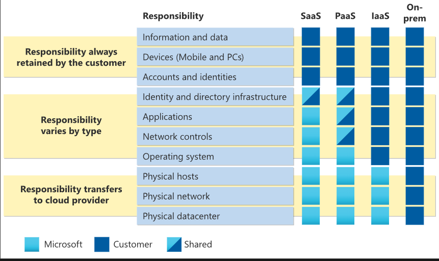
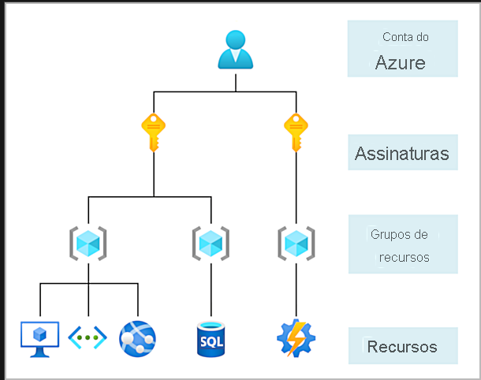
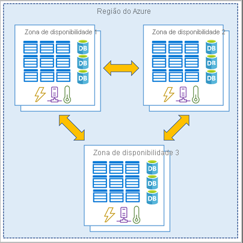
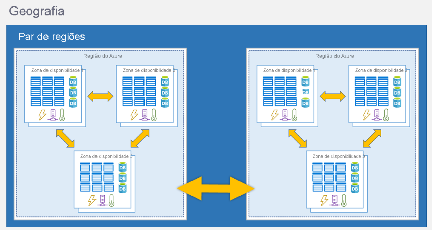

# Compução em nuvem

Cloud computing, ou computação em nuvem, é de fato a entrega de serviços de computação pela internet. Ele fornece acesso a uma variedade de recursos de TI, incluindo servidores, armazenamento, bancos de dados, rede e muito mais, tudo hospedado remotamente em servidores de data center gerenciados por provedores de serviços em nuvem.

As principais características e benefícios do cloud computing incluem:

1. **Escalabilidade**: Os recursos de computação em nuvem podem ser facilmente escalados para cima ou para baixo conforme necessário, permitindo que as empresas aumentem ou reduzam a capacidade de processamento, armazenamento e rede de acordo com a demanda.

2. **Elasticidade**: Além da escalabilidade, a elasticidade permite que os recursos de computação em nuvem se ajustem automaticamente para lidar com flutuações na demanda, garantindo que os aplicativos mantenham o desempenho mesmo durante picos de uso.

3. **Modelo de pagamento por uso**: Com a computação em nuvem, os usuários pagam apenas pelos recursos que consomem, em vez de investir em infraestrutura física que pode não ser totalmente utilizada. Isso ajuda a reduzir os custos operacionais e permite um melhor planejamento financeiro.

4. **Acessibilidade**: Como os serviços em nuvem são acessados pela internet, eles podem ser facilmente acessados de qualquer lugar do mundo, desde que haja uma conexão à internet disponível.

5. **Variedade de serviços**: Além dos recursos de infraestrutura básica, como servidores e armazenamento, os provedores de nuvem oferecem uma ampla gama de serviços adicionais, como Internet das Coisas (IoT), Machine Learning (ML), Inteligência Artificial (IA), análise de dados, segurança cibernética e muito mais.

Em resumo, o cloud computing oferece uma maneira flexível, eficiente e econômica de provisionar e gerenciar recursos de TI, permitindo que as empresas se concentrem em suas operações principais sem se preocupar com a infraestrutura de TI subjacente.

# Modelo de Responsabilidade compartilhada.
O modelo de responsabilidade compartilhada é um conceito fundamental na computação em nuvem que define as responsabilidades entre o provedor de serviços em nuvem e o consumidor. No modelo tradicional de datacenter corporativo, a empresa é responsável por todas as facetas da infraestrutura e da segurança. Com o modelo de responsabilidade compartilhada:

- O provedor de nuvem é responsável pela segurança física, energia, resfriamento e conectividade de rede.
- O consumidor é responsável pelos dados e informações armazenados na nuvem, bem como pela segurança de acesso.

A divisão específica de responsabilidades varia dependendo do tipo de serviço em nuvem utilizado: IaaS, PaaS ou SaaS.

- Na IaaS, o consumidor tem a maior responsabilidade, incluindo a manutenção de sistemas operacionais e aplicativos.
- Na PaaS, a responsabilidade é compartilhada mais equitativamente entre o provedor e o consumidor.
- No SaaS, a maior parte da responsabilidade recai sobre o provedor, incluindo manutenção de aplicativos e dados.

O modelo de responsabilidade compartilhada permite uma distribuição eficiente das responsabilidades, garantindo que a segurança e a operação da infraestrutura em nuvem sejam adequadamente gerenciadas por todas as partes envolvidas.

# Modelos de nuvem
| Aspectos Comparativos          | Nuvem Privada | Nuvem Pública | Nuvem Híbrida |
|--------------------------------|---------------|---------------|---------------|
| Propriedade e controle         | Proprietário/Controle total | Provedor/Controle limitado | Misto/Controle variável |
| Disponibilidade                 | Menos disponibilidade geral | Maior disponibilidade geral | Variável, dependendo da configuração |
| Custos                          | Mais custos | Menos custos | Variável, dependendo da configuração |
| Escalabilidade                  | Menos escalabilidade | Mais escalabilidade | Escalabilidade variável, dependendo da configuração |
| Segurança                       | Controle direto e potencialmente maior segurança | Dependente do provedor | Potencialmente maior segurança com controle personalizado |

- **Nuvem Privada**: Proprietário/controle total, menos disponibilidade geral, mais custos, menos escalabilidade, potencialmente maior segurança.
- **Nuvem Pública**: Provedor/controle limitado, maior disponibilidade geral, menos custos, mais escalabilidade, dependente do provedor em termos de segurança.
- **Nuvem Híbrida**: Mistura de propriedade/controle, disponibilidade e custos variáveis, escalabilidade variável dependendo da configuração, potencialmente maior segurança com controle personalizado.
- **Várias Nuvens**: Este cenário envolve o uso de vários provedores de nuvem pública, permitindo o acesso a recursos diferentes ou migrando entre provedores. Requer gerenciamento de recursos e segurança em ambientes múltiplos.

- **Azure Arc**: Uma suíte de tecnologias que facilita o gerenciamento do ambiente de nuvem, independentemente de ser exclusivamente no Azure, em um datacenter privado, em um ambiente híbrido ou em várias nuvens simultaneamente.

- **Solução VMware no Azure**: Oferece a capacidade de executar cargas de trabalho VMware no ambiente do Azure, mantendo a integração e a escalabilidade total, ideal para empresas que desejam migrar de uma infraestrutura de nuvem privada para uma pública ou híbrida.

# Modelo baseado em consumo 

O modelo baseado em consumo na computação em nuvem é caracterizado pela cobrança de serviços conforme o uso, em oposição a custos fixos. Isso significa que os usuários pagam apenas pelos recursos de TI que realmente utilizam, sem custos iniciais. Essa abordagem oferece flexibilidade e diversos benefícios, como:

1. **Sem custos prévios**: Não há necessidade de investir em infraestrutura física inicialmente.
2. **Elasticidade**: Os recursos podem ser escalados conforme a demanda, permitindo a adição ou remoção de recursos conforme necessário.
3. **Eficiência operacional**: Os custos são planejados e gerenciados com mais eficiência, pois você paga apenas pelo que usa.
4. **Rápida adaptação**: É possível superar desafios empresariais rapidamente, aproveitando soluções de ponta sem a necessidade de investimentos significativos em infraestrutura.

Comparado a modelos tradicionais de datacenters, o modelo baseado em consumo na nuvem elimina preocupações com a capacidade exata de recursos, pois permite ajustes rápidos e pagamentos somente pelo uso efetivo dos recursos, resultando em uma infraestrutura mais eficiente e adaptável às necessidades do negócio.

# Descrever os benefícios da alta disponibilidade e da escalabilidade na nuvem

**SLAs (Contratos de Nível de Serviço)**: São garantias de disponibilidade e desempenho oferecidas por provedores de serviços, como o Azure, especificando o tempo de atividade esperado para os serviços prestados. Os SLAs são importantes para garantir a alta disponibilidade de aplicativos e serviços na nuvem.

**Escalabilidade**: É a capacidade de ajustar recursos de computação conforme necessário para lidar com variações na demanda. A escalabilidade pode ser vertical, aumentando ou diminuindo a capacidade dos recursos, como CPUs e RAM, ou horizontal, adicionando ou removendo instâncias de recursos, como máquinas virtuais ou contêineres.

- **Dimensionamento Vertical**: Aumenta ou diminui a capacidade dos recursos, como CPUs ou RAM, para atender às necessidades de processamento. Isso permite ajustar recursos de forma mais granular, mas pode ter limitações de escalabilidade.

- **Dimensionamento Horizontal**: Adiciona ou remove instâncias de recursos, como máquinas virtuais ou contêineres, para expandir ou reduzir a capacidade de processamento conforme necessário. Isso permite uma escalabilidade mais dinâmica e pode ser automatizado para responder rapidamente às mudanças na demanda.

Em resumo, a alta disponibilidade e a escalabilidade são considerações essenciais ao implantar aplicativos na nuvem, garantindo que os recursos estejam sempre disponíveis quando necessário e possam ser ajustados conforme a demanda, garantindo eficiência operacional e melhor experiência do usuário.

# Descrever os benefícios da alta disponibilidade e da escalabilidade na nuvem

Resumo:

**Confiabilidade na Nuvem**:
- A nuvem oferece uma infraestrutura descentralizada e global, garantindo resiliência e confiabilidade.
- Com recursos implantados em várias regiões, mesmo em caso de falhas catastróficas em uma região, outras regiões permanecem operacionais.
- Recursos como dimensionamento automático e migração automática para regiões alternativas garantem continuidade operacional sem intervenção manual.

**Previsibilidade na Nuvem**:
- Previsibilidade de Desempenho:
  - Dimensionamento automático, balanceamento de carga e alta disponibilidade garantem uma experiência de usuário consistente, mesmo em momentos de picos de tráfego.
- Previsibilidade de Custos:
  - Monitoramento em tempo real do uso de recursos permite a otimização do consumo e a previsão de gastos futuros.
  - Ferramentas como TCO e Calculadora de Preços auxiliam na estimativa e no controle dos custos de uso da nuvem.

Em resumo, a confiabilidade e a previsibilidade na nuvem proporcionam a confiança necessária para desenvolver soluções com eficiência, garantindo a continuidade operacional e o controle dos custos.

# Descrever os benefícios da segurança e da governança na nuvem

**Segurança na Nuvem**:
- A nuvem oferece opções para atender às diversas necessidades de segurança, desde controle total até automação de patches e manutenção.
- Infraestrutura como Serviço (IaaS) permite o controle total da segurança, permitindo gerenciar sistemas operacionais e aplicar patches.
- Plataforma como Serviço (PaaS) ou Software como Serviço (SaaS) oferecem automação de patches e manutenção, aliviando a carga operacional e garantindo a segurança.
- Provedores de nuvem geralmente têm medidas robustas para lidar com ataques DDoS, garantindo a segurança da rede.

**Governança na Nuvem**:
- Recursos de nuvem suportam governança e conformidade, garantindo que todos os recursos atendam aos padrões corporativos e regulatórios.
- Modelos de conjunto facilitam a aplicação e atualização dos padrões corporativos em todos os recursos implantados.
- Auditoria baseada em nuvem sinaliza desvios de conformidade e fornece estratégias de mitigação.
- Estabelecer uma presença de governança desde cedo ajuda a manter a nuvem atualizada, protegida e bem gerenciada.

Em resumo, a segurança e a governança na nuvem oferecem controle, conformidade e proteção aos recursos implantados, garantindo uma operação eficiente e segura na infraestrutura de TI em nuvem.

# Descrever a infraestrutura como serviço

**IaaS (Infraestrutura como Serviço)**:
- Oferece máximo controle sobre os recursos de nuvem, permitindo instalação, configuração e manutenção do sistema operacional, rede, banco de dados, armazenamento, etc.
- Provedor de nuvem é responsável pelo hardware, conectividade de rede com a Internet e segurança física.
- Você é responsável por todo o resto, incluindo instalação, configuração, aplicação de patches, atualizações e segurança do sistema.

**Modelo de Responsabilidade Compartilhada**:
- Aplica-se a todos os tipos de serviços de nuvem.
- No IaaS, a maior parte da responsabilidade recai sobre o cliente.
- Provedor de nuvem é responsável pela manutenção da infraestrutura física e acesso à Internet.
- Cliente é responsável pela instalação, configuração, aplicação de patches, atualizações e segurança do ambiente de nuvem.

Em resumo, no modelo IaaS, o provedor de nuvem fornece a infraestrutura física e o cliente tem controle total sobre a configuração e manutenção dos recursos, enquanto o modelo de responsabilidade compartilhada determina as responsabilidades entre o provedor de nuvem e o cliente em relação à segurança e manutenção dos serviços em nuvem.

**Cenários**:
Alguns cenários comuns em que o IaaS faz sentido incluem:

- Migração lift-and-shift: você conta com recursos de nuvem semelhantes aos do datacenter local e apenas migra os elementos em execução local para execução na infraestrutura IaaS.
- Teste e desenvolvimento: você estabeleceu configurações para ambientes de desenvolvimento e teste que precisa replicar rapidamente. Você pode ativar ou desativar os diferentes ambientes rapidamente com uma estrutura de IaaS, mantendo o controle completo.

# Descrever a plataforma como serviço

Resumo:

**PaaS (Plataforma como Serviço)**:
- Oferece um meio termo entre IaaS e SaaS, onde o provedor de nuvem mantém a infraestrutura física, segurança física, conexão com a Internet, sistemas operacionais, middleware, ferramentas de desenvolvimento e serviços de business intelligence.
- Ideal para fornecer um ambiente de desenvolvimento completo sem se preocupar com a manutenção da infraestrutura.

**Modelo de Responsabilidade Compartilhada**:
- Aplica-se a todos os tipos de serviços de nuvem.
- No PaaS, a responsabilidade é compartilhada entre o cliente e o provedor de nuvem.
- Provedor de nuvem é responsável pela manutenção da infraestrutura física, sistemas operacionais, bancos de dados, ferramentas de desenvolvimento e serviços de business intelligence.
- Cliente é responsável pelas configurações de rede, segurança da rede e do aplicativo, infraestrutura de diretório, dependendo da configuração.

Em resumo, o PaaS fornece um ambiente de desenvolvimento completo, onde o provedor de nuvem assume a responsabilidade pela manutenção da infraestrutura e do software subjacente, enquanto o cliente se concentra no desenvolvimento de aplicativos sem se preocupar com a infraestrutura de backend. O modelo de responsabilidade compartilhada garante uma divisão clara das responsabilidades entre o cliente e o provedor de nuvem.

**Cenários**:

Alguns cenários comuns em que o PaaS faz sentido incluem:

- Estrutura de desenvolvimento: O PaaS fornece uma estrutura que os desenvolvedores podem usar como base para desenvolver ou personalizar aplicativos baseados em nuvem. Semelhante à forma como você cria uma macro do Excel, o PaaS permite aos desenvolvedores criar aplicativos usando componentes de software internos. São incluídos recursos de nuvem, como escalabilidade, alta disponibilidade e a funcionalidade de multilocatário, reduzindo a quantidade de codificação que os desenvolvedores precisam realizar.
- Análise ou business intelligence: as ferramentas fornecidas como serviço com o PaaS permitem que as organizações analisem e minerem dados, encontrando insights e padrões e prevendo resultados para aprimorar a previsão, as decisões de design de produto, o retornos sobre investimentos e outras decisões de negócios.

# Descrever o software como serviço

**SaaS (Software como Serviço)**:
- Oferece aplicativos completamente desenvolvidos para uso através da nuvem, como e-mail, software financeiro e aplicativos de mensagens.
- Menos flexível, porém mais fácil de implementar, exigindo menos conhecimento técnico por parte do usuário.
- Maior responsabilidade recai sobre o provedor de nuvem, que cuida da segurança física dos datacenters, energia, conectividade de rede e desenvolvimento e aplicação de patches dos aplicativos.

**Modelo de Responsabilidade Compartilhada**:
- Aplica-se a todos os tipos de serviços de nuvem.
- No SaaS, a maior parte da responsabilidade é do provedor de nuvem.
- Cliente é responsável pelos dados, dispositivos e usuários que acessam o sistema.
- Provedor de nuvem é responsável pela segurança física dos datacenters, energia, conectividade de rede e desenvolvimento e aplicação de patches dos aplicativos.

Em resumo, o SaaS oferece facilidade de implementação, com a maior parte da responsabilidade pela infraestrutura e aplicativos sendo assumida pelo provedor de nuvem, enquanto o cliente foca na utilização e administração dos dados e usuários. O modelo de responsabilidade compartilhada garante uma clara divisão de responsabilidades entre o cliente e o provedor de nuvem.

**Cenários**

Alguns cenários comuns de SaaS são:

- Email e mensagens.
- Aplicativos de produtividade empresarial.
- Controle de finanças e despesas.

# O que é o Microsoft Azure

O Azure é uma plataforma de serviços de nuvem em expansão, oferecendo uma ampla gama de benefícios e recursos para facilitar a criação de soluções empresariais e inovações futuras:

1. **Inovação Contínua**: A Microsoft está constantemente inovando, oferecendo suporte aos negócios atuais e futuros.
2. **Flexibilidade de Desenvolvimento**: Suporte a software livre, múltiplas linguagens e estruturas para criar e implantar aplicativos de acordo com suas preferências.
3. **Operações Contínuas**: Suporte para nuvem híbrida, permitindo operações locais, na nuvem e na borda, integrando e gerenciando ambientes de forma eficiente.
4. **Segurança e Conformidade**: Oferece segurança desde o início, com equipe de especialistas e conformidade confiável para empresas, governos e startups.

O Azure fornece mais de 100 serviços que permitem uma ampla gama de funcionalidades, desde a execução de aplicativos existentes em máquinas virtuais até a exploração de novos paradigmas de software, como inteligência artificial e aprendizado de máquina. Oferece soluções de armazenamento escaláveis e serviços de IA e ML que permitem criar soluções avançadas e inovadoras na nuvem.

# Introdução a contas do Azure

Para criar e usar os serviços do Azure, é necessário ter uma assinatura do Azure. Ao realizar os módulos no Microsoft Learn, normalmente é fornecida uma assinatura temporária, executada na área restrita do Microsoft Learn. No entanto, para uso em aplicativos e necessidades de negócios próprios, é necessário criar uma conta do Azure, que automaticamente cria uma assinatura. Posteriormente, é possível criar assinaturas adicionais, permitindo a organização de recursos por departamento ou equipe. Após criar uma assinatura do Azure, é possível começar a criar recursos do Azure dentro de cada assinatura.

### Conta Gratuita do Azure

A conta gratuita do Azure inclui:

- Acesso gratuito a produtos populares do Azure por 12 meses.
- Um crédito a ser usado nos primeiros 30 dias.
- Acesso a mais de 25 produtos que são sempre gratuitos.

A conta gratuita do Azure é uma excelente maneira para novos usuários começarem e explorarem. Para se inscrever, você precisa de um número de telefone, um cartão de crédito e uma conta Microsoft ou do GitHub. As informações do cartão de crédito são usadas somente para verificação de identidade. Você não será cobrado por nenhum serviço até que atualize para uma assinatura paga.

### Conta de Estudante Gratuita do Azure

A oferta da conta de estudante gratuita do Azure inclui:

- Acesso gratuito a determinados produtos do Azure por 12 meses.
- Um crédito a ser usado nos primeiros 12 meses.
- Acesso gratuito a determinadas ferramentas para desenvolvedores de software.

A conta de estudante gratuita do Azure é uma oferta para estudantes que oferece US$ 100 de crédito e ferramentas para desenvolvedores gratuitas. Além disso, você pode se inscrever sem um cartão de crédito.

### Área Restrita do Microsoft Learn

Muitos dos exercícios do Microsoft Learn usam uma tecnologia chamada área restrita, que cria uma assinatura temporária que é adicionada à conta do Azure. Essa assinatura temporária permite que você crie recursos do Azure durante o módulo do Microsoft Learn. O Microsoft Learn limpa automaticamente os recursos temporários para você depois de concluir o módulo.

Ao concluir um módulo do Microsoft Learn, você poderá usar a assinatura pessoal para realizar os exercícios do módulo. Porém, a área restrita é o método de uso preferencial, pois permite criar e testar recursos do Azure sem gerar custos para você.

# Infraestrutura Física do Azure

## Infraestrutura Física

A infraestrutura física do Azure é composta por datacenters, regiões e zonas de disponibilidade.

### Datacenters
Os datacenters são instalações físicas que abrigam os recursos de computação, armazenamento e rede do Azure. Eles são semelhantes aos grandes datacenters corporativos e possuem energia, refrigeração e infraestrutura de rede dedicadas.

### Regiões
Uma região é uma área geográfica do planeta que contém pelo menos um data center do Azure, podendo ter vários próximos e conectados por uma rede de baixa latência. O Azure atribui e gerencia recursos de forma inteligente dentro de cada região para garantir um balanceamento adequado das cargas de trabalho.

**Observação:**
Alguns serviços ou recursos de VM (máquina virtual) estão disponíveis somente em determinadas regiões, como tamanhos específicos de VMs ou tipos de armazenamento. Também há alguns serviços globais do Azure que não exigem que você selecione uma região específica, como o Azure Active Directory, o Gerenciador de Tráfego do Azure e o DNS do Azure.

### Zonas de Disponibilidade
As zonas de disponibilidade são conjuntos de datacenters físicos separados dentro de uma região do Azure. Cada zona de disponibilidade possui sua própria infraestrutura de energia, resfriamento e rede, sendo configurada para proporcionar isolamento. Se uma zona falhar, as outras continuarão operando, garantindo alta disponibilidade e resiliência para as cargas de trabalho críticas.

Esses componentes formam a base da infraestrutura física do Azure, permitindo a distribuição global de recursos e a entrega confiável de serviços em nuvem para clientes em todo o mundo.

**Importante:**
Para garantir a resiliência, no mínimo três zonas de disponibilidade separadas estão presentes em todas as regiões habilitadas para zona de disponibilidade. No entanto, nem todas as Regiões do Azure atualmente dão suporte a zonas de disponibilidade.

### Usando Zonas de Disponibilidade

É crucial garantir a redundância dos seus serviços e dados para proteger suas informações em caso de falha. O Azure oferece suporte para tornar seus aplicativos altamente disponíveis por meio das zonas de disponibilidade.

Você pode aproveitar as zonas de disponibilidade para executar aplicativos críticos e incorporar alta disponibilidade à arquitetura do aplicativo, colocando recursos de computação, armazenamento, rede e dados em uma zona de disponibilidade e replicando-os em outras zonas de disponibilidade. É importante estar ciente de que pode haver um custo associado à duplicação de serviços e à transferência de dados entre zonas de disponibilidade.

As zonas de disponibilidade são destinadas principalmente a VMs, discos gerenciados, balanceadores de carga e bancos de dados SQL. Os serviços do Azure que dão suporte às zonas de disponibilidade se enquadram em três categorias:

- **Serviços em Zonas:** Você pode fixar o recurso a uma zona específica (por exemplo, VMs, discos gerenciados, endereços IP).
- **Serviços com Redundância de Zona:** A plataforma replica automaticamente entre zonas (por exemplo, armazenamento com redundância de zona, Banco de Dados SQL).
- **Serviços Não Regionais:** Esses serviços estão sempre disponíveis em geografias do Azure e são resilientes a interrupções em toda a zona, bem como a interrupções em toda a região.

Apesar da resiliência adicional proporcionada pelas zonas de disponibilidade, é possível que um evento afete várias zonas de disponibilidade em uma única região. Para fornecer ainda mais resiliência, o Azure oferece Pares de Regiões.

### Pares de Regiões

A maioria das regiões do Azure é emparelhada com outra região na mesma geografia, a pelo menos 300 milhas de distância. Esse emparelhamento permite a replicação de recursos em uma geografia, reduzindo a probabilidade de interrupções devido a eventos como desastres naturais. Se uma região em um par de regiões for afetada, os serviços poderão fazer failover automaticamente para a outra região no par.

**Importante:**
Nem todos os serviços do Azure replicam dados automaticamente ou retornam automaticamente de uma região com falha para replicação cruzada para outra região habilitada. Nesses cenários, a recuperação e a replicação devem ser configuradas pelo cliente.

Exemplos de pares de regiões no Azure são Oeste dos EUA emparelhado com Leste dos EUA e Sudeste da Ásia emparelhado com Leste da Ásia. Como o par de regiões está diretamente conectado e suficientemente afastado para ser isolado contra desastres regionais, você pode usá-lo para fornecer redundância de dados e serviços confiáveis.

### Vantagens Adicionais dos Pares de Regiões:

1. **Priorização de Restauração em Caso de Interrupção Ampla:**
   - Em caso de uma interrupção generalizada do Azure, uma região de cada par de regiões será priorizada para garantir que pelo menos uma delas seja restaurada o mais rápido possível. Isso assegura a continuidade dos aplicativos hospedados nesse par de regiões.

2. **Atualizações Planejadas Distribuídas:**
   - As atualizações planejadas do Azure são distribuídas para regiões emparelhadas uma por vez. Esse método é adotado para minimizar o tempo de inatividade e reduzir o risco de interrupção dos aplicativos. 

3. **Residência de Dados na Mesma Geografia:**
   - Os dados continuam residindo na mesma geografia que seu par, com exceção do Sul do Brasil. Isso é crucial para fins de jurisdição fiscal e aplicação da lei, garantindo que as leis e regulamentos locais sejam aplicados aos dados armazenados.

**Importante:**
A maioria das regiões é emparelhada em duas direções, o que significa que elas são o backup para a região que fornece um backup para elas (Oeste dos EUA e Leste dos EUA fazem backup entre si). No entanto, algumas regiões, como Índia Ocidental e Sul do Brasil, são emparelhadas em apenas uma direção. Em um emparelhamento de uma direção, a região primária não fornece backup para a região secundária. Assim, mesmo que a região secundária da Índia Ocidental seja o Sul da Índia, o Sul da Índia não depende da Índia Ocidental. A região secundária do Oeste da Índia é o Sul da Índia, mas a região secundária do Sul da Índia é a Índia Central. O Sul do Brasil é exclusivo porque ele está associado a uma região fora de sua região geográfica. A região secundária do Sul do Brasil é o Centro-Sul dos EUA. A região secundária do Centro-Sul dos EUA não é Sul do Brasil.

### Regiões Soberanas

Além das regiões normais, o Azure também oferece regiões soberanas, que são instâncias isoladas do Azure em relação à instância principal. Essas regiões podem ser necessárias por motivos legais ou de conformidade.

As regiões soberanas do Azure incluem:

- **US DoD Central, US Gov – Virgínia, US Gov Iowa, entre outros:**
  - Estas regiões são instâncias lógicas e físicas do Azure isoladas da rede principal, destinadas a parceiros e órgãos do governo dos EUA. Operadas por cidadãos selecionados dos EUA, esses datacenters possuem certificações de conformidade adicionais.

- **Leste da China, Norte da China, entre outros:**
  - Estas regiões estão disponíveis através de uma parceria exclusiva entre a Microsoft e a 21Vianet, onde a Microsoft não é diretamente responsável pela manutenção dos data centers.