# Descrever as contas de armazenamento do Azure

Resumindo, ao criar uma conta de armazenamento no Azure, você escolhe o tipo de conta que determina os serviços de armazenamento e as opções de redundância disponíveis. As opções de redundância incluem:

1. LRS (armazenamento com redundância local)
2. GRS (armazenamento com redundância geográfica)
3. RA-GRS (armazenamento com redundância geográfica com acesso de leitura)
4. ZRS (armazenamento com redundância de zona)
5. GZRS (armazenamento com redundância de zona geográfica)
6. RA-GZRS (armazenamento com redundância de zona geográfica com acesso de leitura)

Além disso, ao nomear sua conta de armazenamento, você precisa seguir algumas regras:

- O nome da conta deve ter entre 3 e 24 caracteres e conter apenas números e letras minúsculas.
- O nome da conta deve ser exclusivo no Azure para garantir um namespace exclusivo.
- Cada serviço de armazenamento tem seu próprio ponto de extremidade, que segue um formato específico, como:
  - Armazenamento de Blobs: `https://<nome-da-conta-de-armazenamento>.blob.core.windows.net`
  - Data Lake Storage Gen2: `https://<nome-da-conta-de-armazenamento>.dfs.core.windows.net`
  - Arquivos do Azure: `https://<nome-da-conta-de-armazenamento>.file.core.windows.net`
  - Armazenamento de Filas: `https://<nome-da-conta-de-armazenamento>.queue.core.windows.net`
  - Armazenamento de Tabelas: `https://<nome-da-conta-de-armazenamento>.table.core.windows.net`

Esses pontos de extremidade permitem acessar os diferentes serviços de armazenamento em sua conta usando HTTP ou HTTPS de qualquer lugar do mundo.

# Descrever a redundância de armazenamento do Azure

O Armazenamento do Azure oferece redundância para garantir a proteção e disponibilidade dos dados contra falhas e eventos não planejados. Aqui está um resumo:

- **Redundância na região primária**: Os dados em uma conta de Armazenamento do Azure são replicados três vezes na região primária. Existem duas opções de replicação na região primária: LRS (armazenamento com redundância local) e ZRS (armazenamento com redundância de zona).

    - **LRS (armazenamento com redundância local)**: Replica os dados três vezes dentro de um único data center na região primária. Oferece uma durabilidade de pelo menos 11 noves (99,999999999%) dos objetos em um ano.

    - **ZRS (armazenamento com redundância de zona)**: Replica os dados três vezes em zonas de disponibilidade diferentes dentro da mesma região primária. Isso fornece proteção adicional contra falhas em um único data center, pois os dados são distribuídos entre diferentes zonas de disponibilidade.

Essas opções garantem que seus dados estejam protegidos contra falhas de hardware, interrupções de energia, falhas de rede e outros eventos adversos, garantindo alta disponibilidade e durabilidade.

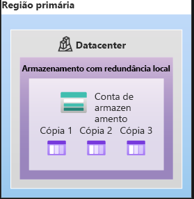

O LRS é uma opção de redundância de menor custo no Armazenamento do Azure, mas oferece a menor durabilidade em comparação com outras opções. Ele protege os dados contra falhas de unidade e rack do servidor, mas em caso de desastre no data center, como incêndios ou inundações, todas as réplicas podem ser perdidas. Para mitigar esse risco, a Microsoft recomenda o uso de outras opções como ZRS, GRS ou GZRS.

- **Armazenamento com redundância de zona (ZRS)**: Em regiões com zonas de disponibilidade, o ZRS replica os dados de maneira síncrona em três zonas de disponibilidade do Azure na região primária. Isso oferece uma durabilidade de pelo menos 12 noves (99,9999999999%) dos objetos de dados do Armazenamento do Azure em um ano.

Essa opção fornece uma camada adicional de proteção, distribuindo os dados entre diferentes zonas de disponibilidade dentro da mesma região, garantindo maior resiliência contra falhas e desastres em comparação com o LRS.

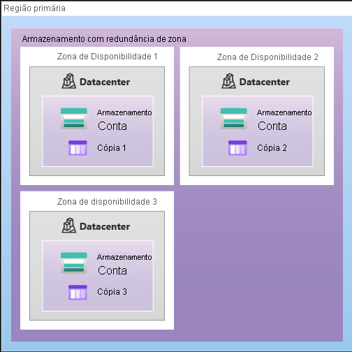

O ZRS (armazenamento com redundância de zona) no Azure replica os dados de maneira síncrona em três zonas de disponibilidade dentro da mesma região primária, oferecendo alta disponibilidade mesmo em caso de falha em uma zona. Isso permite acessar os dados para operações de leitura e gravação, mesmo que uma zona esteja indisponível. O Azure realiza atualizações de rede, como redirecionamento de DNS, para garantir a continuidade do serviço, embora possa haver impacto no aplicativo durante esse processo.

Para garantir alta durabilidade, especialmente em caso de falhas catastróficas, como incêndios ou desastres naturais, a Microsoft recomenda usar redundância em uma região secundária. Isso envolve copiar os dados para uma região secundária, que está a uma distância considerável da região primária. Existem duas opções para isso: GRS (armazenamento com redundância geográfica) e GZRS (armazenamento com redundância de zona geográfica).

- **GRS**: Replica os dados três vezes em um único local físico na região primária usando LRS e, em seguida, replica os dados de maneira assíncrona em um único local físico na região secundária (o par da região) usando LRS. Oferece durabilidade de pelo menos 16 noves (99,99999999999999%) dos objetos de dados do Armazenamento do Azure em um ano.

Essa configuração proporciona uma camada adicional de proteção, garantindo que os dados sejam duráveis mesmo em casos extremos, com cópias armazenadas em locais físicos distintos, mantendo uma alta disponibilidade e durabilidade para seus dados.

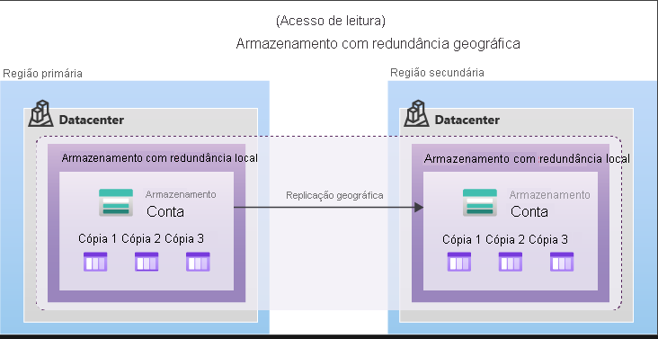

- **Armazenamento com redundância de zona geográfica**
O GZRS combina a alta disponibilidade fornecida pela redundância entre zonas de disponibilidade com a proteção contra interrupções regionais fornecidas pela replicação geográfica. Os dados em uma conta de armazenamento GZRS são copiados entre três zonas de disponibilidade do Azure na região primária (semelhante ao ZRS) e são replicados em uma região geográfica secundária usando LRS para proteção contra desastres regionais. A Microsoft recomenda o uso do GZRS para aplicativos que exigem consistência, durabilidade e disponibilidade máximas, excelente desempenho e resiliência para recuperação de desastres.

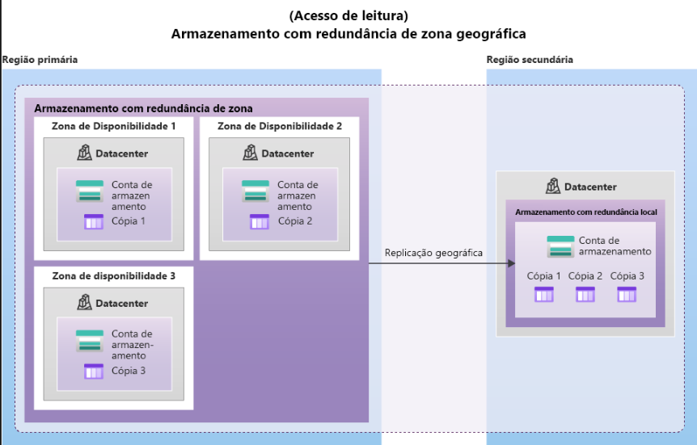

O GZRS foi projetado para fornecer pelo menos 16 noves (99,99999999999999%) de durabilidade dos objetos durante um determinado ano.

- **Acesso de leitura aos dados na região secundária**
O armazenamento com redundância geográfica (com GRS ou GZRS) replica seus dados para outro local físico na região secundária para proteger contra interrupções regionais. No entanto, esses dados estarão disponíveis para serem lidos somente se o cliente ou a Microsoft iniciar um failover da região primária para a secundária. No entanto, se você habilitar o acesso de leitura à região secundária, seus dados estarão sempre disponíveis, mesmo que a região primária esteja sendo executada de maneira ideal. Para obter acesso de leitura para o local secundário, habilite o armazenamento com redundância geográfica com acesso de leitura (RA-GRS) ou o armazenamento com redundância de zona com acesso de leitura (RA-GZRS).

Importante

Lembre-se de que os dados em sua região secundária podem não estar atualizados devido ao RPO.

# Descrever os serviços do armazenamento do Azure

A plataforma de Armazenamento do Microsoft Azure inclui os seguintes serviços de dados:

- **Blobs do Azure**: Um repositório altamente escalonável para objetos de texto e dados binários. Também oferece suporte para análise de Big Data por meio do Data Lake Storage Gen2.

- **Arquivos do Azure**: Compartilhamentos de arquivos gerenciados para implantações locais e em nuvem.

- **Filas do Azure**: Um armazenamento de mensagens para comunicação confiável entre componentes de aplicativos.

- **Azure Disks**: Volumes de armazenamento em nível de bloco para máquinas virtuais (VMs) do Azure.

- **Tabelas do Azure**: Uma opção de tabela NoSQL para dados estruturados e não relacionais.

O Armazenamento do Microsoft Azure oferece diversos benefícios aos desenvolvedores de aplicativos e profissionais de TI:

- **Durável e altamente disponível**: A redundância garante a segurança dos dados, inclusive contra falhas de hardware. Replicação em data centers ou regiões geográficas adicionais pode proteger contra catástrofes locais ou desastres naturais.

- **Seguro**: Todos os dados são criptografados pelo serviço e oferecem controle refinado sobre o acesso aos dados.

- **Escalonável**: Projetado para atender às necessidades de desempenho e armazenamento dos aplicativos modernos.

- **Gerenciado**: A Microsoft cuida da manutenção de hardware, atualizações e problemas críticos.

- **Acessível**: Os dados podem ser acessados de qualquer lugar do mundo via HTTP/HTTPS, com suporte em diversas linguagens e ferramentas.

**Blobs do Azure**:
- Armazenamento de objetos altamente escalonável para texto e dados binários.
- Útil para armazenar grandes quantidades de dados não estruturados.
- Ideal para imagens, vídeos, backups, e dados de análise de Big Data.

**Arquivos do Azure**:
- Compartilhamentos de arquivos gerenciados na nuvem, acessíveis via SMB ou NFS.
- Totalmente gerenciados, sem necessidade de gerenciar hardware ou sistema operacional.
- Suporta acesso simultâneo de implantações locais e em nuvem.

**Filas do Azure**:
- Armazenamento de mensagens para comunicação assíncrona entre componentes de aplicativos.
- Integrável com funções de computação, como o Azure Functions, para processamento de mensagens.

**Discos do Azure**:
- Volumes de armazenamento em nível de bloco para VMs do Azure.
- Gerenciados pelo Azure, oferecendo maior resiliência e disponibilidade.

**Tabelas do Azure**:
- Armazena grandes quantidades de dados estruturados.
- Repositório NoSQL acessível por chamadas autenticadas, ideal para dados estruturados não relacionais.

# Identificar as opções de migração de dados do Azure

O Azure oferece suporte a diferentes métodos de migração para transferir dados e informações para a nuvem:

**Migrações para Azure**:
- Um serviço que facilita a migração de um ambiente local para a nuvem Azure.
- Oferece um portal unificado para iniciar, executar e monitorar a migração.
- Inclui uma variedade de ferramentas para avaliação e migração, como Descoberta e Avaliação do Migrações para Azure, Migração de Servidor, Assistente de Migração de Dados e outros.
- Permite avaliar e migrar infraestrutura local para o Azure de maneira eficiente.

**Azure Data Box**:
- Um serviço de migração física para transferir grandes volumes de dados de maneira rápida e confiável.
- Utiliza dispositivos de armazenamento físico Data Box para transferência de dados, com capacidade máxima de 80 terabytes.
- Ideal para cenários com conectividade de rede limitada ou inexistente e para transferências de dados em massa.
- Cenários de uso incluem migração única, movimentação de bibliotecas de mídia, migração de VMs e aplicativos, transferências em massa inicial e carregamentos periódicos.
- Permite a importação e exportação de dados do Azure em cenários como recuperação de desastres, requisitos de segurança e migração de volta para o local ou para outro provedor de nuvem.

Ambos os serviços oferecem soluções flexíveis e eficazes para migrar dados para a nuvem Azure, atendendo a uma variedade de necessidades e cenários de uso.

# Identificar as opções de movimentação de arquivos do Azure

O Azure oferece várias ferramentas para mover ou interagir com arquivos individuais ou grupos de arquivos pequenos:

**AzCopy**:
- Um utilitário de linha de comando para copiar, carregar, baixar e sincronizar blobs ou arquivos entre contas de armazenamento do Azure.
- Pode ser configurado para trabalhar com outros provedores de nuvem.
- A sincronização é de apenas uma direção, com origem e destino designados pelo usuário.

**Gerenciador de Armazenamento do Azure**:
- Um aplicativo autônomo que fornece uma interface gráfica para gerenciar arquivos e blobs em contas de armazenamento do Azure.
- Funciona em sistemas operacionais Windows, macOS e Linux.
- Usa o AzCopy no back-end para executar tarefas de gerenciamento de arquivos e blobs.

**Sincronização de Arquivos do Azure**:
- Uma ferramenta para centralizar compartilhamentos de arquivos no serviço Arquivos do Azure e manter a flexibilidade, desempenho e compatibilidade de um servidor de arquivos do Windows.
- Permite a sincronização bidirecional automática entre arquivos locais em um servidor Windows e arquivos no Azure.
- Suporta diferentes protocolos de acesso, como SMB, NFS e FTPS.
- Possibilita a configuração de caches em todo o mundo e a replicação local de arquivos acessados com mais frequência.

# Descrever os serviços de diretório do Azure

O **Microsoft Entra ID** é uma solução destinada a administradores de TI, desenvolvedores de aplicativos, usuários e assinantes de serviços online. Ele fornece serviços como autenticação, logon único, gerenciamento de aplicativos e dispositivos.

Uma ferramenta importante é o **Microsoft Entra Connect**, que permite a sincronização de identidades entre o Active Directory local e o Microsoft Entra ID, garantindo uma experiência de identidade consistente entre a nuvem e o ambiente local.

Além disso, o **Microsoft Entra Domain Services** oferece serviços de domínio gerenciado, como ingresso no domínio, política de grupo, LDAP e autenticação Kerberos/NTLM, sem a necessidade de implantar controladores de domínio na nuvem.

Ao criar um domínio gerenciado do Microsoft Entra Domain Services, dois controladores de domínio do Windows Server são implantados na região do Azure selecionada. Esses controladores de domínio são gerenciados automaticamente pela plataforma Azure, incluindo backups e criptografia em repouso.

A sincronização de informações é unidirecional do Microsoft Entra ID para o Microsoft Entra Domain Services. Em um ambiente híbrido, o Microsoft Entra Connect sincroniza as informações de identidade entre o Active Directory local e o Microsoft Entra ID, que por sua vez é sincronizado com o domínio gerenciado.

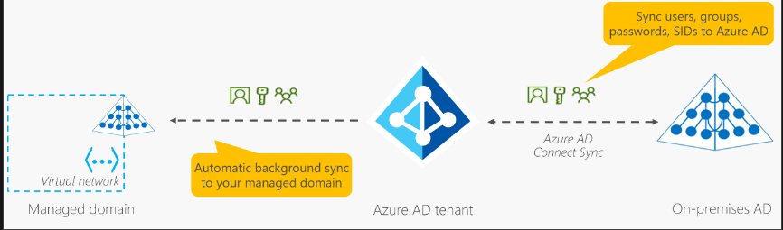

Em seguida, os aplicativos, serviços e VMs no Azure que se conectam a esse domínio gerenciado poderão usar recursos comuns do Microsoft Entra Domain Services, como o ingresso no domínio, a política de grupo, o LDAP e a autenticação Kerberos/NTLM.

# Descrever os métodos de autenticação do Azure

O processo de autenticação é essencial para estabelecer a identidade de uma pessoa, serviço ou dispositivo, exigindo a apresentação de credenciais para confirmar a identidade declarada. O Azure suporta vários métodos de autenticação, incluindo senhas padrão, SSO (logon único), MFA (autenticação multifator) e métodos sem senha.

Tradicionalmente, a segurança e a conveniência eram consideradas em conflito. No entanto, soluções de autenticação modernas equilibram segurança e conveniência.

Um diagrama ilustra essa relação, destacando que a Autenticação sem senha oferece alta segurança e alta conveniência, enquanto o uso exclusivo de senhas proporciona baixa segurança, mas alta conveniência.

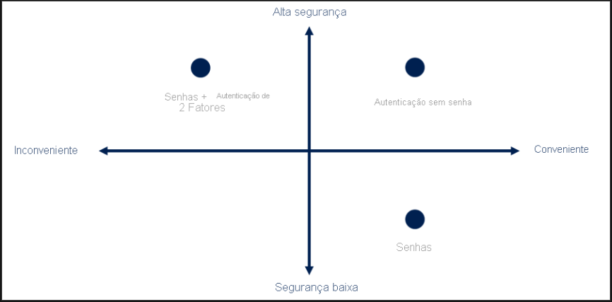

O logon único (SSO) permite que um usuário acesse vários recursos e aplicativos de diferentes provedores, inserindo suas credenciais uma única vez. Isso simplifica o processo de autenticação, reduzindo a quantidade de senhas que os usuários precisam lembrar e aumentando a conveniência. Porém, a segurança do SSO depende da segurança do autenticador inicial.

A autenticação multifator (MFA) é um processo que requer um segundo fator de identificação além da senha durante o login, aumentando a segurança. Esse segundo fator pode ser algo que o usuário sabe, possui ou é, como um código enviado para um telefone celular.

A autenticação sem senha substitui a senha por outros métodos de autenticação, como credenciais biométricas ou dispositivos confiáveis, como smartphones. Isso aumenta a conveniência para os usuários e reduz o risco de exposição de senha.

O Microsoft Entra oferece suporte a esses métodos de autenticação sem senha, incluindo:

- Windows Hello para Empresas: uma solução para PC Windows que utiliza credenciais biométricas ou PIN associadas ao dispositivo do usuário.
- Aplicativo Microsoft Authenticator: transforma o telefone do usuário em uma credencial sem senha, requerendo confirmação através de gestos biométricos ou PIN.
- Chaves de segurança FIDO2: dispositivos de hardware que manipulam a autenticação, aumentando a segurança da conta.

# Descrever as identidades externas do Azure

O recurso de Identidades Externas do Microsoft Entra permite colaborar com usuários fora da organização de forma segura, oferecendo diversas funcionalidades:

1. **Colaboração B2B (Business to Business)**: Permite que usuários externos usem suas próprias identidades para acessar aplicativos empresariais, como aplicativos Microsoft ou SaaS. Esses usuários são representados como convidados em seu diretório.

2. **Conexão direta de B2B**: Estabelece uma relação de confiança mútua com outras organizações do Microsoft Entra, permitindo colaboração contínua. Os usuários externos não são representados em seu diretório, mas podem acessar recursos compartilhados, como canais no Microsoft Teams.

3. **Microsoft Azure Active Directory entre empresa e cliente (B2C)**: Permite publicar aplicativos SaaS ou personalizados para consumidores e clientes, usando o Azure AD B2C para gerenciamento de identidade e acesso.

Essas funcionalidades permitem interagir com organizações externas e compartilhar recursos conforme necessário. Com o Microsoft Entra ID, é possível convidar usuários externos, garantir que tenham acesso apropriado e realizar revisões de acesso para manter a segurança dos recursos compartilhados.

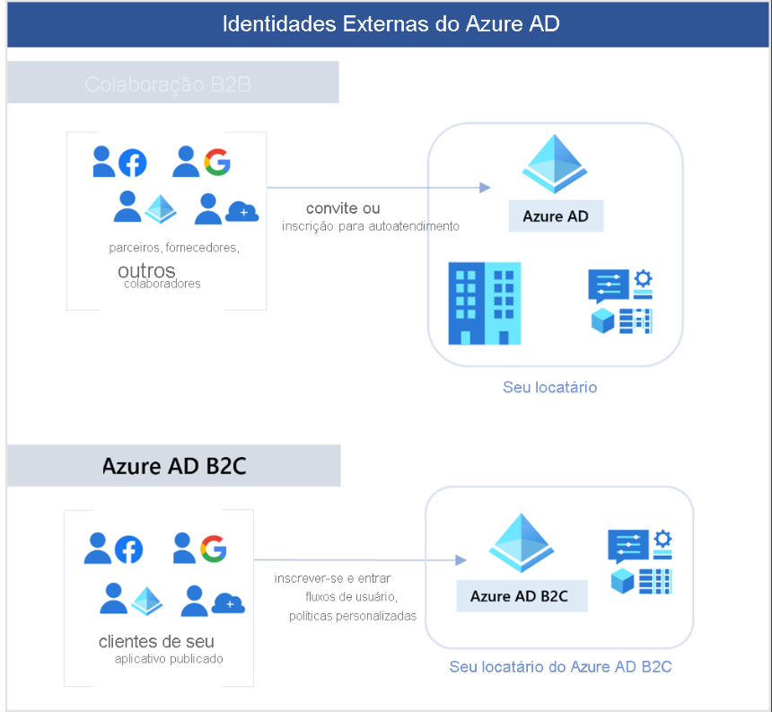

# Descrever o acesso condicional do Azure

O Acesso Condicional, uma ferramenta do Microsoft Entra ID, permite o acesso a recursos com base em sinais de identidade, como usuário, localização e dispositivo. Ele oferece os seguintes benefícios para os administradores de TI:

1. Capacitar os usuários a serem produtivos em qualquer lugar e sempre, garantindo que tenham acesso aos recursos necessários onde quer que estejam.
2. Proteger os ativos da organização, controlando o acesso com base em diferentes sinais de identidade.

Além disso, o Acesso Condicional proporciona uma experiência de autenticação multifator mais granular para os usuários. Por exemplo, um segundo fator de autenticação pode não ser solicitado se o usuário estiver em uma localização conhecida, mas pode ser exigido se os sinais de conexão do usuário forem incomuns ou se ele estiver em uma localização inesperada.

Durante a conexão, o Acesso Condicional coleta sinais do usuário, toma decisões com base nesses sinais e impõe essa decisão, permitindo ou negando a solicitação de acesso ou solicitando uma resposta de autenticação multifator, conforme necessário.

O seguinte diagrama ilustra esse fluxo:
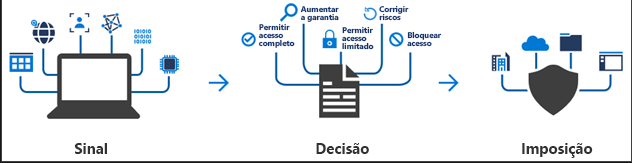

O acesso condicional é uma ferramenta que utiliza sinais como a localização do usuário, o dispositivo utilizado e o aplicativo acessado para tomar decisões sobre o acesso a recursos. Com base nesses sinais, ele pode permitir ou bloquear o acesso, ou exigir uma segunda forma de autenticação, como a autenticação multifator (MFA).

Você pode usar o acesso condicional em várias situações, tais como:

1. Exigir MFA para acessar aplicativos com base na função, localização ou rede do usuário, como exigir MFA para administradores, mas não para usuários regulares, ou para conexões fora da rede corporativa.
2. Permitir o acesso apenas por meio de aplicativos cliente aprovados, como limitar quais aplicativos de e-mail podem se conectar ao serviço de e-mail.
3. Exigir que os usuários acessem um aplicativo apenas de dispositivos gerenciados que atendam aos padrões de segurança e conformidade.
4. Bloquear o acesso de fontes não confiáveis, como locais desconhecidos ou inesperados.

O acesso condicional proporciona um controle mais granular sobre o acesso aos recursos, garantindo maior segurança e conformidade.

# Descrever o controle de acesso baseado em função do Azure

O controle de acesso baseado em função é aplicado a um escopo, que é um recurso ou um conjunto de recursos ao qual esse acesso se aplica.

O diagrama a seguir mostra a relação entre funções e escopos. Um grupo de gerenciamento, uma assinatura ou um grupo de recursos pode receber a função de proprietário, passando a ter maior controle e autoridade. Um observador, que não deve fazer atualizações, pode receber uma função de Leitor para o mesmo escopo, permitindo que ele examine ou observe o grupo de gerenciamento, a assinatura ou o grupo de recursos.

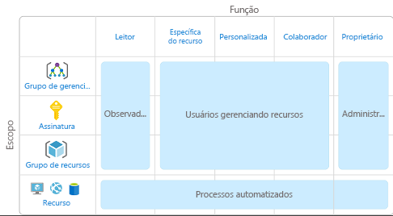

O RBAC (Controle de Acesso Baseado em Função) do Azure é imposto em qualquer ação iniciada em um recurso do Azure que passe pelo Azure Resource Manager, que é um serviço de gerenciamento para organizar e proteger recursos de nuvem. Ele opera em um modelo de permissão, onde cada função atribuída a um usuário concede permissões específicas dentro de um determinado escopo.

Os escopos no RBAC do Azure incluem um grupo de gerenciamento (uma coleção de várias assinaturas), uma assinatura única, um grupo de recursos e um recurso individual. O RBAC é hierárquico, o que significa que as permissões concedidas em um escopo pai são herdadas por todos os escopos filhos.

Por exemplo:

- Se você atribuir a função Proprietário a um usuário no escopo do grupo de gerenciamento, esse usuário terá permissão para gerenciar todos os recursos em todas as assinaturas dentro desse grupo de gerenciamento.

- Se você atribuir a função Leitor a um grupo no escopo da assinatura, os membros desse grupo poderão visualizar todos os grupos de recursos e os recursos dentro da assinatura.

O RBAC do Azure não impõe permissões de acesso no nível do aplicativo ou dos dados, e a segurança do aplicativo precisa ser gerenciada separadamente. As atribuições de função podem conceder várias permissões em um mesmo escopo, combinando as permissões concedidas por diferentes funções atribuídas ao mesmo usuário.

# Descrever o modelo de Confiança Zero

A Confiança Zero é um modelo de segurança que presume uma violação desde o início e verifica cada solicitação como se ela viesse de uma rede não confiável. Este modelo pressupõe o pior cenário e protege os recursos com essa expectativa.

Para enfrentar os desafios dos ambientes de computação modernos, onde a força de trabalho é móvel e os recursos estão dispersos, a Microsoft recomenda o modelo de segurança de Confiança Zero. Esse modelo se baseia em princípios orientadores, incluindo:

1. Verificação explícita: sempre autenticar e autorizar com base em todos os pontos de dados disponíveis.
2. Privilégios mínimos de acesso: limitar o acesso do usuário usando Just-In-Time e Just-Enough-Access, políticas adaptáveis baseadas em risco e proteção de dados.
3. Presumir a violação: minimizar o alcance do acesso, segmentar o acesso, verificar a criptografia de ponta a ponta e usar análise para obter visibilidade e promover a detecção de ameaças.

A Confiança Zero altera o paradigma tradicional de segurança, onde as redes corporativas eram consideradas restritas e seguras. Em vez de confiar na segurança da rede, a Confiança Zero requer autenticação para todos os dispositivos e concede acesso com base na autenticação, não na localização.

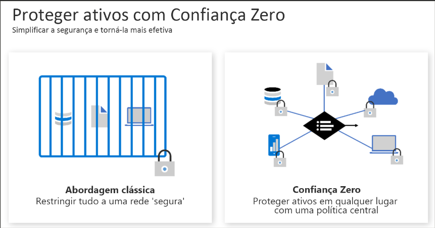

# Descrever a defesa em profundidade

- **Camadas da defesa em profundidade:**
Você pode visualizar a defesa em profundidade como um conjunto de camadas, com os dados a serem protegidos no centro e todas as outras camadas funcionando para proteger essa camada de dados central.

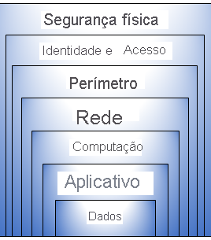

O conceito de defesa em profundidade envolve a implementação de múltiplas camadas de segurança para proteger os recursos, de modo que se uma camada for violada, outras camadas estejam em vigor para evitar a exposição adicional. Cada camada fornece proteção específica e colabora para a segurança geral do ambiente. As camadas e suas funções incluem:

1. **Segurança física**: Protege o hardware de computação no datacenter, controlando o acesso físico aos edifícios e aos ativos de hardware.

2. **Identidade e acesso**: Garante a segurança das identidades, concede acesso apenas ao necessário e registra eventos de entrada e alterações.

3. **Perímetro**: Protege contra ataques baseados na rede, como ataques DDoS, filtrando esses ataques antes que possam afetar a disponibilidade do sistema.

4. **Rede**: Limita a comunicação entre recursos, reduzindo o risco de disseminação de ataques para outros sistemas na rede.

5. **Computação**: Garante que os recursos de computação estejam seguros, protegendo o acesso às máquinas virtuais e mantendo os sistemas atualizados e com patches.

6. **Aplicativo**: Integra a segurança no ciclo de vida de desenvolvimento do aplicativo para reduzir vulnerabilidades e garantir que os aplicativos sejam seguros por padrão.

7. **Dados**: Controla o acesso aos dados corporativos e do cliente, garantindo a confidencialidade, integridade e disponibilidade dos dados armazenados.

O Azure fornece ferramentas e recursos de segurança em todos os níveis do conceito de defesa em profundidade, permitindo que as organizações implementem medidas de segurança abrangentes e adaptáveis às necessidades específicas de seu ambiente.

# Descrever o Microsoft Defender para Nuvem

O Microsoft Defender para Nuvem é uma ferramenta de monitoramento que visa fortalecer a postura de segurança e proteger contra ameaças em ambientes de nuvem, locais, híbridos e de várias nuvens. Ele fornece diretrizes, notificações e ferramentas para proteger recursos, acompanhar a postura de segurança e simplificar o gerenciamento de segurança. O Defender para Nuvem é nativamente integrado ao Azure e oferece proteção em várias camadas:

1. **Proteções nativas do Azure**: Monitora e detecta ameaças em serviços PaaS do Azure, serviços de dados do Azure e redes, proporcionando avaliações de vulnerabilidades e recomendações de mitigação.

2. **Proteção de recursos híbridos**: Estende a proteção para ambientes híbridos, incluindo servidores não Azure, através do Azure Arc, oferecendo inteligência contra ameaças personalizada e alertas priorizados.

3. **Recursos em outras nuvens**: O Defender para Nuvem também pode proteger recursos em outras nuvens, como AWS e GCP, estendendo suas funcionalidades para serviços como CSPM, Microsoft Defender para Contêineres e Microsoft Defender para Servidores.

A implantação do Defender para Nuvem é fácil e integra-se nativamente ao Azure, monitorando automaticamente os serviços do Azure e, quando necessário, implantando agentes para coletar dados de segurança em ambientes híbridos e de várias nuvens. Essa abordagem abrangente ajuda as organizações a manterem seus ambientes seguros e protegidos contra ameaças cibernéticas.

### Avaliar, proteger e defender
O Defender para Nuvem preenche três necessidades vitais à medida que você gerencia a segurança de seus recursos e cargas de trabalho locais e na nuvem:

* Avaliação contínua – Conheça sua postura de segurança. Identifique e rastreie vulnerabilidades.
* Proteger – Proteja recursos e serviços com o Azure Security Benchmark.
*  Defender – Detecte e resolva ameaças a recursos, cargas de trabalho e serviços.

O Microsoft Defender para Nuvem oferece soluções abrangentes para avaliar continuamente o ambiente em nuvem, garantindo a segurança das cargas de trabalho. Ele inclui ferramentas de avaliação de vulnerabilidades para máquinas virtuais, registros de contêiner e servidores SQL, fornecendo verificações regulares e detalhadas de vulnerabilidades em computação, dados e infraestrutura.

As políticas de segurança no Defender para Nuvem são baseadas nos controles do Azure Policy, proporcionando flexibilidade e cobertura abrangente para criar e aplicar políticas personalizadas em todo o ambiente. Ele monitora continuamente novos recursos implantados e avalia se estão configurados conforme as práticas recomendadas de segurança. Caso contrário, sinaliza e fornece recomendações priorizadas para correção, com suporte do Azure Security Benchmark.

As recomendações são agrupadas em controles de segurança e atribuídas a uma classificação de segurança, proporcionando uma visão rápida da integridade da postura de segurança. Isso permite que as organizações priorizem e implementem medidas corretivas para melhorar sua segurança geral. O Defender para Nuvem capacita as organizações a manterem um ambiente seguro e em conformidade com as melhores práticas de segurança.

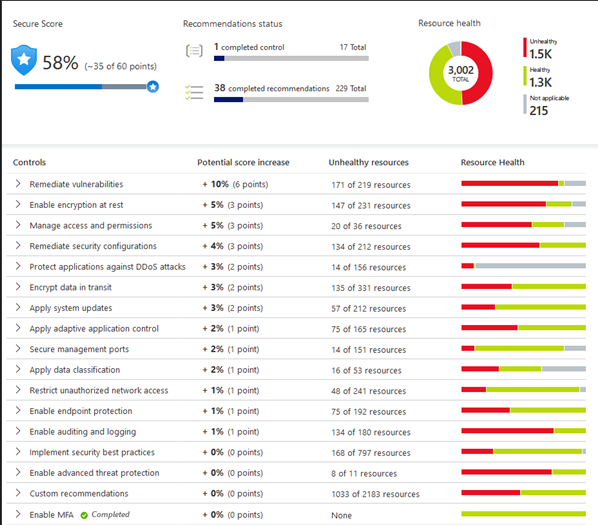

O Defender para Nuvem não apenas avalia e monitora o ambiente, mas também ajuda a defender contra ameaças, fornecendo alertas de segurança e recursos avançados de proteção. Quando detecta uma ameaça, ele gera alertas detalhados, descrevendo os recursos afetados e sugerindo etapas de correção. Além disso, oferece a opção de acionar um aplicativo lógico em resposta a certos alertas. O Defender para Nuvem também fornece proteção avançada contra ameaças, incluindo recursos como acesso just-in-time para proteger as portas de gerenciamento de máquinas virtuais e controles de aplicativos adaptáveis para criar listas de permissões de aplicativos permitidos em computadores.

# Descrever fatores que podem afetar os custos no Azure

O Azure desloca os custos de desenvolvimento de CapEx (despesa de capital) para OpEx (despesa operacional) ao fornecer a infraestrutura como serviço. Esses custos operacionais podem variar devido a vários fatores:

- Tipo de recurso: Diferentes recursos do Azure têm custos diferentes, dependendo de sua complexidade e demanda.
- Consumo: O custo é diretamente afetado pelo uso dos recursos, medido em termos de tempo de utilização, armazenamento usado, largura de banda consumida, entre outros.
- Manutenção: Os custos de manutenção, incluindo atualizações, patches de segurança e suporte técnico, contribuem para o custo operacional.
- Geografia do aplicativo: A região do Azure onde os recursos são implantados pode influenciar os custos devido a variações nos preços de infraestrutura e largura de banda.
- Tipo de assinatura: As opções de assinatura, como Pay-As-You-Go, Enterprise Agreement ou Azure Reservations, podem afetar os custos operacionais.
- Azure Marketplace: A utilização de serviços de terceiros disponíveis no Azure Marketplace pode adicionar custos adicionais à operação.

Em resumo, o custo operacional no Azure é determinado por uma combinação de fatores, incluindo o tipo de recurso usado, o consumo, a manutenção, a localização geográfica, o tipo de assinatura e o uso de serviços de terceiros.

O modelo de pagamento do Azure permite o pagamento conforme o uso, onde os usuários pagam apenas pelos recursos consumidos durante um ciclo de cobrança, oferecendo flexibilidade máxima. No entanto, também oferece a opção de reservar capacidade com antecedência e receber descontos nesses recursos "reservados", proporcionando economias significativas em cargas de trabalho confiáveis e consistentes.

A manutenção do ambiente de nuvem é essencial para controlar os custos, e o uso de grupos de recursos ajuda a manter os recursos organizados. É importante ficar atento aos recursos desnecessários para controlar os custos.

A escolha da região de implantação também pode afetar os custos devido a diferenças nos custos de energia, mão de obra, impostos e taxas. O tráfego de rede também é afetado pela região geográfica, com custos diferenciados para transferências de dados dentro e fora das zonas de cobrança.

Além disso, o tipo de assinatura do Azure e a utilização do Azure Marketplace também podem afetar os custos, com algumas assinaturas incluindo concessões de uso e o Marketplace oferecendo soluções e serviços baseados no Azure de fornecedores de terceiros, com estruturas de cobrança definidas pelo fornecedor.

# Descreva a ferramenta Gerenciamento de Custos da Microsoft

O Gerenciamento de Custos do Azure é um serviço que permite aos usuários verificar os custos dos recursos do Azure, criar alertas com base nos gastos e estabelecer orçamentos para automatizar o gerenciamento de recursos.

A análise de custo oferece uma visualização rápida dos custos do Azure, permitindo que os usuários visualizem o custo total de várias maneiras, como por ciclo de cobrança, região ou tipo de recurso.

Os alertas de custo fornecem notificações sobre três tipos de alertas: alertas de orçamento, alertas de crédito e alertas de cota de gastos do departamento. Os alertas de orçamento avisam quando os gastos atingem ou excedem um valor definido, os alertas de crédito notificam sobre o consumo de compromissos monetários e os alertas de cota de gastos do departamento alertam quando os gastos do departamento atingem um limite fixo.

Os orçamentos permitem definir limites de gastos para o Azure com base em assinaturas, grupos de recursos, tipos de serviço ou outros critérios. Quando um orçamento atinge o nível de alerta, ele dispara um alerta que é exibido na área de alertas de custo e pode enviar uma notificação por e-mail. O uso avançado de orçamentos permite a automação de recursos suspensos ou modificados após a ocorrência de uma condição de gatilho.

# Descrever a finalidade das marcas

As marcas de recursos são uma ferramenta poderosa para organizar e gerenciar eficientemente os recursos na nuvem. Elas fornecem metadados adicionais sobre os recursos, facilitando diversas atividades, como gerenciamento de recursos, otimização, segurança, governança e automação. Aqui está um resumo dos principais pontos:

1. **Gerenciamento de recursos:** As marcas ajudam a localizar recursos associados a cargas de trabalho, ambientes, unidades de negócios e proprietários específicos, facilitando ações relacionadas a esses recursos.

2. **Gerenciamento e otimização de recursos:** Permitem agrupar recursos para relatar custos, alocar centros de custos internos, acompanhar orçamentos e prever custos estimados.

3. **Gerenciamento de operações:** Permitem classificar recursos com base na importância da disponibilidade para os negócios, auxiliando na definição de SLAs.

4. **Segurança:** Permitem classificar dados pelo nível de segurança, como público ou confidencial.

5. **Governança e conformidade regulatória:** Identificam recursos que se alinham com requisitos de conformidade ou governança, como ISO 27001, e facilitam a imposição de padrões.

6. **Automação e otimização de carga de trabalho:** Ajudam a visualizar e executar tarefas automatizadas em recursos associados a implantações complexas.

Para gerenciar marcas de recursos, você pode adicionar, modificar ou excluir marcas usando várias ferramentas, como Windows PowerShell, CLI do Azure, modelos do Azure Resource Manager, API REST ou portal do Azure. O Azure Policy pode ser usado para impor regras e convenções de marcação, garantindo consistência e conformidade. Uma estrutura de marcação pode incluir nomes e valores para diferentes atributos, como nome do aplicativo, centro de custo, proprietário, ambiente e impacto.

É importante entender que não é necessário impor a presença de uma marca específica em todos os recursos. Você pode decidir aplicar marcas apenas em recursos críticos, por exemplo, e considerar os recursos não marcados como menos críticos. Essa flexibilidade permite criar esquemas de marcação personalizados que se adaptam às necessidades de sua organização.