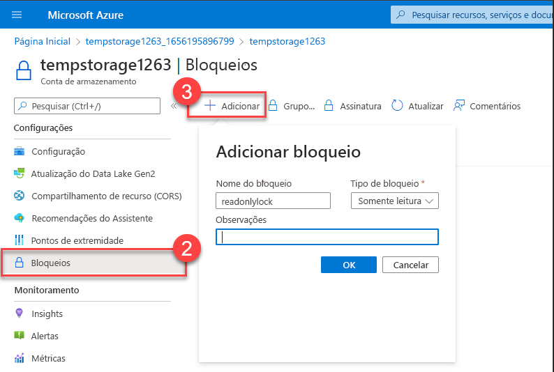
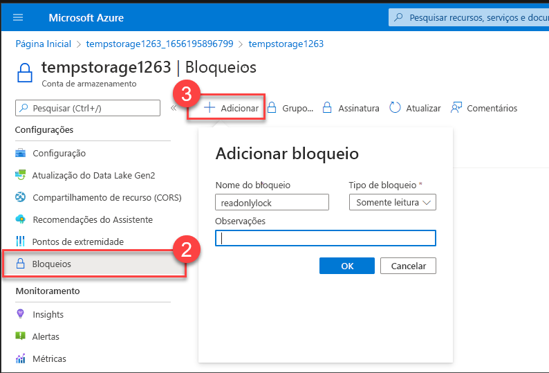
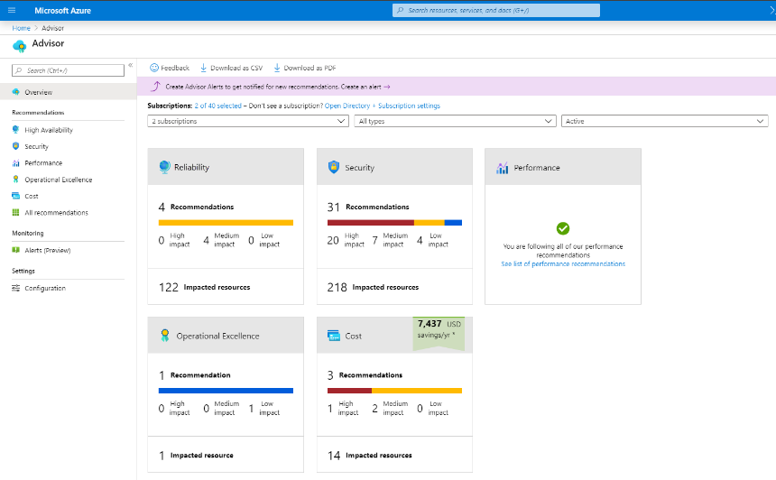
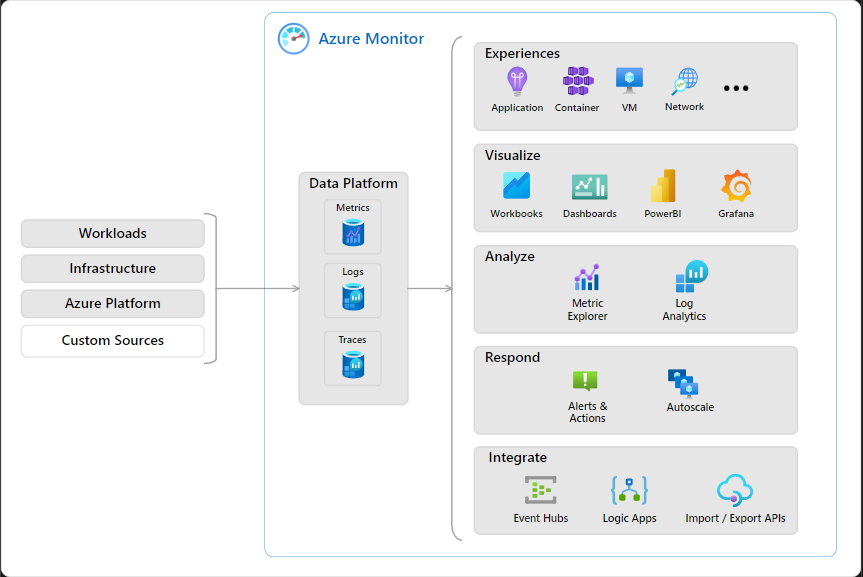

# Descrever a finalidade do Microsoft Purview

O Microsoft Purview é uma família de soluções de governança, risco e conformidade de dados oferecida pela Microsoft. Ele ajuda as organizações a obter uma visão unificada de seus dados, independentemente de estarem armazenados localmente, em várias nuvens ou em serviços de software como serviço (SaaS).

As principais funcionalidades do Microsoft Purview incluem:

1. Descoberta de dados automatizada: O Purview automatiza o processo de descoberta de dados, permitindo que as organizações identifiquem onde seus dados estão armazenados e como estão sendo utilizados.

2. Classificação de dados confidenciais: Ele classifica automaticamente os dados com base em suas sensibilidades, ajudando as organizações a identificar e proteger dados confidenciais.

3. Linhagem de dados de ponta a ponta: O Purview fornece uma visão completa da linhagem dos dados, permitindo rastrear sua origem, transformações e uso ao longo do tempo.

O Microsoft Purview aborda duas áreas principais de solução:

1. Soluções de risco e conformidade: Esta área do Purview se concentra em ajudar as organizações a proteger seus dados confidenciais, gerenciar riscos de dados e garantir conformidade com regulamentações.

2. Governança unificada de dados: Esta área aborda a gestão eficaz dos dados, fornecendo recursos para mapear, identificar, proteger e gerenciar o acesso aos dados armazenados em diferentes locais e plataformas.

O Purview utiliza recursos do Microsoft 365, como Microsoft Teams, OneDrive e Exchange, para gerenciar e monitorar dados, oferecendo uma abordagem integrada para a gestão de dados.

Em resumo, o Microsoft Purview é uma solução abrangente que ajuda as organizações a entender, proteger e gerenciar seus dados de forma eficaz em todo o seu ambiente de TI.

# Descrever a finalidade do Azure Policy

O Azure Policy é um serviço do Azure que permite criar, atribuir e gerenciar políticas para controlar ou auditar recursos em conformidade com padrões corporativos. Ele funciona através da definição de políticas individuais e agrupamentos chamados iniciativas. As políticas podem ser aplicadas em diferentes níveis, como recursos específicos, grupos de recursos ou assinaturas, e são herdadas automaticamente.

Essas políticas são avaliadas em tempo real, destacando recursos que não estão em conformidade e, em alguns casos, podem corrigir automaticamente as configurações não conformes. O Azure Policy também se integra ao Azure DevOps para aplicar políticas durante as fases de pré e pós-implantação de aplicativos.

As iniciativas do Azure Policy agrupam políticas relacionadas para ajudar a alcançar objetivos maiores de conformidade. Por exemplo, a iniciativa "Habilitar o Monitoramento na Central de Segurança do Azure" inclui várias políticas relacionadas à segurança, como monitoramento de banco de dados SQL não criptografado e monitoramento de vulnerabilidades de sistema operacional. Essas iniciativas simplificam o gerenciamento de políticas em ambientes complexos.

# Descrever a finalidade dos bloqueios de recursos

Os bloqueios de recursos no Azure são uma medida de segurança que impede a exclusão ou alteração acidental de recursos críticos na nuvem. Existem dois tipos de bloqueios: um que impede a exclusão e outro que impede a modificação ou exclusão de um recurso. Esses bloqueios podem ser aplicados a recursos individuais, grupos de recursos ou toda a assinatura e são herdados pelos recursos dentro do grupo de recursos.

Para gerenciar os bloqueios de recursos, você pode usar o portal do Azure, PowerShell, CLI do Azure ou modelos do Azure Resource Manager. No portal do Azure, os bloqueios podem ser vistos, adicionados ou removidos na seção Configurações do painel Configurações de um recurso.

Para excluir ou modificar um recurso bloqueado, é necessário seguir um processo de duas etapas. Primeiro, o bloqueio precisa ser removido e, em seguida, as ações desejadas podem ser realizadas. Mesmo que você seja o proprietário do recurso, ainda será necessário remover o bloqueio para realizar a atividade bloqueada, pois os bloqueios de recursos são independentes das permissões de RBAC.

# Exercício – Configurar um bloqueio de recurso

Tarefa 1: Criar um recurso
1. Faça login no portal do Microsoft Azure em https://portal.azure.com.
2. Selecione "Criar um recurso".
3. Em "Categorias", escolha "Armazenamento".
4. Selecione "Conta de Armazenamento" e clique em "Criar".
5. Na guia "Básico" da folha "Criar conta de armazenamento", preencha as informações solicitadas, mantendo os padrões para o restante.
   - "Grupo de recursos": Crie um novo grupo de recursos.
   - "Nome da conta de armazenamento": Insira um nome exclusivo para a conta de armazenamento.
   - "Localização": Mantenha o padrão.
   - "Desempenho": Padrão.
   - "Redundância": LRS (Armazenamento com Redundância Local).
6. Clique em "Revisar + Criar" para revisar as configurações e validar.
7. Depois de validar, clique em "Criar" e aguarde a notificação de que a conta foi criada com sucesso.
8. Selecione "Ir para o recurso".

Tarefa 2: Aplicar um bloqueio de recurso somente leitura
1. Role para baixo até encontrar a seção "Configurações" na folha, à esquerda da tela.
2. Selecione "Bloqueios".
3. Clique em "+ Adicionar".

Tarefa 2: Aplicar um bloqueio de recurso somente leitura

1. Role para baixo até encontrar a seção "Configurações" na folha, à esquerda da tela.
2. Selecione "Bloqueios".
3. Clique em "+ Adicionar".

# Descrever ferramentas para interagir com o Azure

O Azure oferece diversas ferramentas para gerenciar seu ambiente na nuvem, incluindo o Portal do Azure, o Azure PowerShell e a CLI (Interface de Linha de Comando) do Azure.

- **Portal do Azure**: É um console unificado baseado na Web que oferece uma interface gráfica para gerenciar recursos e assinaturas do Azure. Permite a criação de painéis personalizados e configurações de acessibilidade.

- **Azure Cloud Shell**: É uma ferramenta de shell baseada em navegador que suporta tanto o Azure PowerShell quanto a CLI do Azure. Ele pode ser acessado pelo portal do Azure e oferece uma experiência de shell sem a necessidade de instalação ou configuração local.

- **Azure PowerShell**: É um shell que permite aos desenvolvedores, DevOps e profissionais de TI executar comandos chamados de cmdlets para gerenciar recursos no Azure. Os cmdlets chamam a API REST do Azure para realizar tarefas de gerenciamento e podem ser executados independentemente ou combinados em scripts.

- **CLI do Azure**: Funcionalmente equivalente ao Azure PowerShell, mas com sintaxe de comandos Bash. Permite realizar tarefas de gerenciamento no Azure através de comandos Bash e pode ser instalado em plataformas Windows, Linux e Mac, assim como acessado pelo Azure Cloud Shell.

Ambos o Azure PowerShell e a CLI do Azure têm funcionalidades semelhantes, sendo a principal diferença a sintaxe dos comandos. A escolha entre eles geralmente depende da preferência pessoal do usuário em relação à linguagem de script.

# Descrever a finalidade do Azure Arc

O Azure Arc é uma ferramenta poderosa que estende a conformidade e o monitoramento do Azure para ambientes híbridos e multinuvem. Ele simplifica a governança e o gerenciamento, oferecendo uma plataforma de gerenciamento local e de várias nuvens consistente. Com o Azure Arc, você pode:

1. Gerenciar todo o seu ambiente, projetando recursos que não são do Azure no Azure Resource Manager (ARM).
2. Gerenciar máquinas virtuais híbridas e de várias nuvens, clusters do Kubernetes e bancos de dados, como se estivessem sendo executados no Azure.
3. Utilizar as funcionalidades familiares de gerenciamento e serviços do Azure, independentemente de onde esses recursos estejam hospedados.
4. Continuar utilizando práticas de ITOps tradicionais, enquanto introduz práticas de DevOps para dar suporte a novos padrões nativos de nuvem em seu ambiente.
5. Configurar localizações personalizadas como uma camada de abstração no cluster de Kubernetes habilitado para Azure Arc e nas extensões de cluster.

O Azure Arc atualmente oferece suporte ao gerenciamento dos seguintes tipos de recursos hospedados fora do Azure:

1. Servidores
2. Clusters do Kubernetes
3. Serviços de Dados do Azure
4. SQL Server
5. Máquinas virtuais (em versão prévia)

Essa capacidade do Azure Arc permite que as organizações gerenciem e governem seus ambientes de forma unificada, independentemente da localização ou da plataforma de nuvem utilizada.

# Descrever modelos do Azure Resource Manager e do ARM do Azure

O Azure Resource Manager (ARM) é um serviço de implantação e gerenciamento do Azure que permite criar, atualizar e excluir recursos na conta do Azure. Ele é utilizado sempre que há interação com recursos do Azure, seja por meio de ferramentas, APIs ou SDKs. O ARM autentica e autoriza solicitações, as quais são enviadas para os serviços do Azure, executando as ações solicitadas. Alguns benefícios do ARM incluem:

1. Gerenciamento da infraestrutura por meio de modelos declarativos em formato JSON.
2. Implantação, gerenciamento e monitoramento de recursos como um grupo.
3. Reimplantação consistente da solução durante o ciclo de vida de desenvolvimento.
4. Definição de dependências entre recursos para implantação na ordem correta.
5. Aplicação de controle de acesso integrado nativamente à plataforma de gerenciamento.
6. Aplicação de marcas para organização lógica e esclarecimento da cobrança.

A infraestrutura como código é um conceito em que a infraestrutura é gerenciada por meio de linhas de código, usando ferramentas como o Azure Cloud Shell, Azure PowerShell ou a CLI do Azure. O Azure Resource Manager facilita a implantação e a configuração de recursos por meio de modelos, como:

- **Modelos de ARM**: Descrevem os recursos em formato JSON, garantindo a verificação prévia da implantação e a orquestração dos recursos interdependentes para implantação na ordem correta. Permitem resultados repetidos, modularidade e extensibilidade por meio de scripts de implantação.

- **Bicep**: É uma linguagem declarativa para implantar recursos do Azure, mais concisa e fácil de ler do que o JSON. Oferece suporte a todos os tipos de recursos e versões de API do Azure, com sintaxe mais simples e resultados repetidos garantidos pela idempotência dos arquivos Bicep. Permitem modularidade e orquestração facilitada pelo Azure Resource Manager.

# Descrever a finalidade do Assistente do Azure

O Assistente do Azure é uma ferramenta que avalia os recursos do Azure e fornece recomendações para melhorar a confiabilidade, segurança, desempenho, excelência operacional e redução de custos na nuvem. Ele foi projetado para ajudar os usuários a otimizarem seus ambientes na nuvem de forma eficiente, poupando tempo.

Principais características e funcionalidades do Assistente do Azure:

1. **Recomendações Personalizadas**: Fornece recomendações específicas para cada usuário com base nas necessidades e configurações de suas assinaturas e recursos.

2. **Disponibilidade no Portal do Azure e API**: As recomendações podem ser acessadas tanto através do portal do Azure quanto por meio de uma API, permitindo uma integração flexível com outras ferramentas e sistemas.

3. **Notificações Configuráveis**: É possível configurar notificações para ser alertado sobre novas recomendações, garantindo que os usuários estejam sempre cientes das oportunidades de otimização.

4. **Categorias de Recomendação**: As recomendações são agrupadas em cinco categorias principais: confiabilidade, segurança, desempenho, excelência operacional e custo. Cada categoria visa melhorar um aspecto específico do ambiente na nuvem.

5. **Filtros e Seleção Personalizada**: Os usuários podem aplicar filtros para selecionar recomendações específicas para assinaturas, grupos de recursos ou serviços, permitindo uma abordagem mais direcionada para otimização.

Em resumo, o Assistente do Azure oferece uma maneira abrangente e eficiente de melhorar continuamente a eficácia e a eficiência dos recursos na nuvem do Azure.

# Descrever a Integridade do Serviço do Azure

A Integridade do Serviço do Azure é uma solução que ajuda os usuários a acompanhar o status e a integridade de sua infraestrutura na nuvem do Azure. Ela combina três serviços principais:

1. **Status do Azure**: Oferece uma visão global do status do Azure, informando sobre interrupções de serviço em todas as regiões do Azure. É útil para incidentes com impacto generalizado.

2. **Integridade do Serviço**: Fornece uma visão mais restrita dos serviços e regiões específicos do Azure que o usuário está usando. Ele se concentra nos serviços relevantes para o usuário e permite configurar alertas para ser notificado sobre problemas de serviço, manutenção planejada e outras alterações que possam afetar seus recursos.

3. **Resource Health**: Oferece uma visão personalizada da integridade dos recursos específicos do Azure utilizados pelo usuário, como instâncias de máquinas virtuais. Por meio do Azure Monitor, é possível configurar alertas para notificar sobre alterações de disponibilidade desses recursos.

A Integridade do Serviço do Azure fornece uma visão completa do ambiente do Azure, desde o status global dos serviços e regiões até recursos específicos. Ela também armazena alertas históricos para revisão posterior, permitindo investigar anomalias e tendências ao longo do tempo. Além disso, fornece links para suporte em caso de eventos que afetam as cargas de trabalho dos usuários.

# Descrever o Azure Monitor

O Azure Monitor é uma plataforma que permite coletar dados sobre seus recursos, analisar esses dados, visualizar informações e agir com base nos resultados. Ele monitora recursos do Azure, locais e de várias nuvens, fornecendo uma visão abrangente do ambiente de nuvem. O Azure Monitor consiste em três componentes principais:

1. **Azure Log Analytics**: Uma ferramenta para escrever e executar consultas de log nos dados coletados pelo Azure Monitor. Ele suporta consultas simples e complexas, permitindo análises detalhadas dos dados coletados.

2. **Alertas do Azure Monitor**: São acionados quando o Azure Monitor detecta que um limite definido foi ultrapassado. Os alertas podem ser baseados em logs ou métricas e podem acionar ações de notificação ou ações corretivas.

3. **Application Insights**: Um recurso do Azure Monitor que monitora aplicativos da web, permitindo monitoramento em tempo real do desempenho e da disponibilidade dos aplicativos. Ele fornece métricas detalhadas, como taxas de solicitação, tempos de resposta e taxas de falha, permitindo identificar e resolver problemas rapidamente.

O Azure Monitor oferece uma visão completa do ambiente do Azure, desde o status global dos serviços e regiões até recursos específicos, permitindo análises detalhadas e ação rápida em caso de problemas.

